# Project：Nexus — 安绪桌面伴侣

> **一句话**: AstrBot 插件，让安绪拥有统一 AI 大脑，跨 QQ/微信/飞书/WebChat 共享对话记忆。
>
> **当前**: Nexus_brain v0.8.0-dev (向量记忆 ✅) + Nexus_Desktop (桌宠身体 🆕 待开工)
>
> **总体进度**: █████████████████░░░ 92%

---

## 📖 目录

| # | 章节 |
|---|------|
| 0 | [项目全景](#0-项目全景) |
| 1 | [Hub 集中式架构](#1-hub-集中式架构) |
| 2 | [令牌握手机制](#2-令牌握手机制) |
| 3 | [多平台消息路由](#3-多平台消息路由) |
| 4 | [RAG 清洗与记忆追溯](#4-rag-清洗与记忆追溯) |
| 5 | [记忆系统：三层安全网](#5-记忆系统三层安全网) |
| 6 | [记忆系统：四阶段质量优化](#6-记忆系统四阶段质量优化) |
| 7 | [小本本段管理](#7-小本本段管理) |
| 8 | [容量控制](#8-容量控制) |
| 9 | [Brain 模块拆分](#9-brain-模块拆分-v070-dev) |
| 10 | [WS 重连机制](#10-ws-重连机制) |
| 11 | [桌面端](#11-桌面端) |
| 12 | [版本演进总览](#12-版本演进总览) |
| 13 | [v0.8.0 向量记忆系统](#13-v080-向量记忆系统) |
| A | [附录：原始更新日志](#a-附录原始更新日志) |

---

## 0. 项目全景

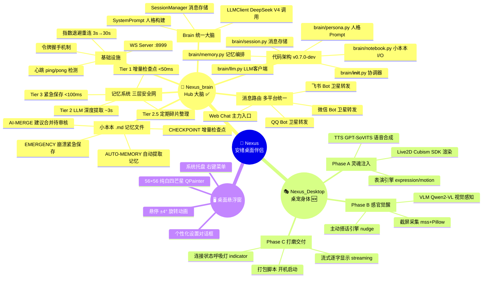

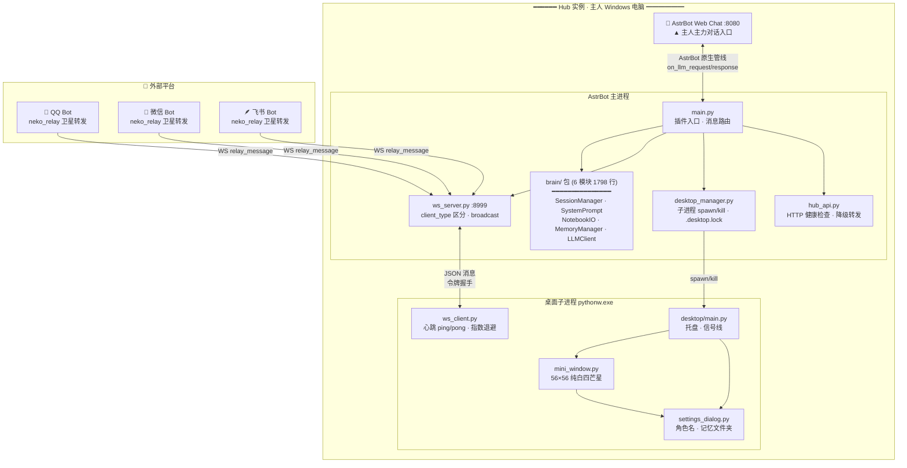

```text
                               🌟 Nexus — 安绪桌面伴侣
                              ═══════════════════════════════

  ┌─────────────────────────────────────────────────────────────────────────────┐
  │                    🖥️ 主人 Windows 电脑 — Hub 实例                          │
  │                                                                             │
  │  ┌───────────────────────────────────────────────────────────────────────┐ │
  │  │                    AstrBot 主进程                                     │ │
  │  │                                                                       │ │
  │  │  ┌──────────────────────────┐  ┌──────────────────────────────────┐  │ │
  │  │  │   main.py (插件入口)      │  │   brain/ 包 (6 模块 · 1798 行)   │  │ │
  │  │  │                          │  │                                  │  │ │
  │  │  │  · 消息路由              │  │  __init__  Brain 协调器          │  │ │
  │  │  │  · 配置持久化            │  │  session   消息存储 · 持久化     │  │ │
  │  │  │  · WS 消息分发           │  │  persona   人格 Prompt           │  │ │
  │  │  │  · 子进程启停            │  │  notebook  小本本 I/O            │  │ │
  │  │  └──────────┬───────────────┘  │  memory    三层安全网 · 提取     │  │ │
  │  │             │                  │  llm       LLM 调用 · provider   │  │ │
  │  │             │                  └──────────────────────────────────┘  │ │
  │  │  ┌──────────┴───────────────────────────────────────────────────┐    │ │
  │  │  │                    Hub 服务                                   │    │ │
  │  │  │                                                               │    │ │
  │  │  │  ws_server.py    desktop_manager.py    hub_api.py             │    │ │
  │  │  │  :8999/nexus     spawn/kill/.lock      HTTP 健康检查          │    │ │
  │  │  └──────────────────────┬────────────────────────────────────────┘    │ │
  │  │                         │ WS                                          │ │
  │  └─────────────────────────┼──────────────────────────────────────────────┘ │
  │                            │                                                │
  │  ┌─────────────────────────┼──────────────────────────────────────────┐    │
  │  │             桌面子进程  │  pythonw.exe (无黑窗)                      │    │
  │  │                         │                                          │    │
  │  │  ┌──────────────────────┴──────────────────────────────────┐      │    │
  │  │  │              desktop/main.py (托盘 · 信号线)             │      │    │
  │  │  └──┬─────────────────────────────┬────────────────────────┘      │    │
  │  │     │                             │                                │    │
  │  │  ┌──▼──────────────────┐  ┌──────▼──────────────────────┐         │    │
  │  │  │ mini_window.py      │  │ settings_dialog.py          │         │    │
  │  │  │ 56×56 纯白四芒星    │  │ 角色名 · 记忆文件夹         │         │    │
  │  │  │ QPainter 贝塞尔曲线 │  │ 暗色主题 QDialog            │         │    │
  │  │  │ 悬停旋转动画        │  └─────────────────────────────┘         │    │
  │  │  └─────────────────────┘                                          │    │
  │  │                                                                   │    │
  │  │  ┌──────────────────────────────────────────────────────────┐    │    │
  │  │  │        ws_client.py — WS 客户端 (QThread)                 │    │    │
  │  │  │        令牌握手 · 心跳 15s ping/pong · 指数退避 3s→30s    │    │    │
  │  │  └──────────────────────────────────────────────────────────┘    │    │
  │  └────────────────────────────────────────────────────────────────────┘    │
  │                                                                             │
  │  ┌────────────────────────────────────────────┐                             │
  │  │  💬 AstrBot Web Chat :8080                 │                             │
  │  │  ▲ 主人主力对话入口 (功能全 · 零维护)       │                             │
  │  └────────────────────────────────────────────┘                             │
  └─────────────────────────────────────────────────────────────────────────────┘

  ┌──────────┐    ┌──────────┐    ┌──────────┐
  │ 🐧 QQ    │    │ 💚 微信  │    │ 🪶 飞书  │
  │ 卫星 Bot │    │ 卫星 Bot │    │ 卫星 Bot │
  └────┬─────┘    └────┬─────┘    └────┬─────┘
       │               │               │
       └───────────────┼───────────────┘
                       │ WS relay_message
                       ▼
              ┌────────────────┐
              │ Hub :8999/nexus│
              └────────────────┘

  ═════════════════════════════════════════════════════════════════════
  🆕 Nexus_Desktop (独立插件 · 待开工)
  ═════════════════════════════════════════════════════════════════════
  Phase A 灵魂注入  │  Live2D Cubism · 表演引擎 · TTS 语音
  Phase B 感官觉醒  │  截屏 mss · VLM 视觉 · 主动搭话
  Phase C 打磨交付  │  流式显示 · 呼吸灯 · 打包启动
```

---

## 1. Hub 集中式架构

安绪的大脑是一个 **Hub 实例**，运行在主人的 Windows 电脑上。所有平台的消息都汇聚到同一个 Brain 处理，共享 100% 的对话上下文和记忆。

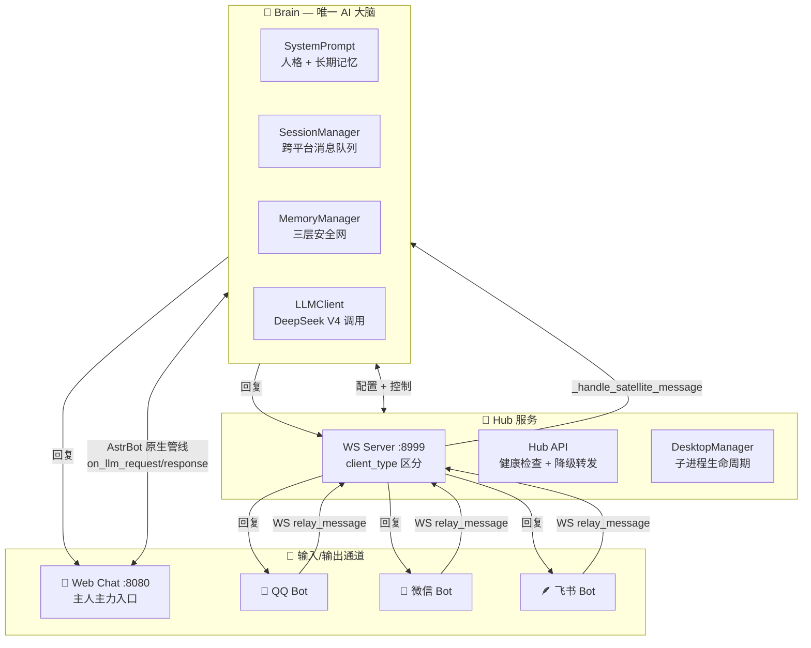

```text
                    🧠 Hub 集中式架构 — 唯一 Brain + 多通道接入

    ┌──────────────────────────────────────────────────────────────┐
    │                     Brain — 唯一 AI 大脑                      │
    │                                                              │
    │  ┌─────────────────┐  ┌──────────────────────────────────┐   │
    │  │ SystemPrompt    │  │ SessionManager                   │   │
    │  │ 人格 + 长期记忆  │  │ 跨平台统一消息队列                │   │
    │  └─────────────────┘  └──────────────────────────────────┘   │
    │  ┌─────────────────┐  ┌──────────────────────────────────┐   │
    │  │ MemoryManager   │  │ LLMClient                        │   │
    │  │ 三层安全网       │  │ DeepSeek V4 调用                 │   │
    │  └─────────────────┘  └──────────────────────────────────┘   │
    └──────────┬──────────────┬──────────────┬─────────────────────┘
               │              │              │
    ┌──────────▼──┐  ┌───────▼──────┐  ┌────▼──────────────────────┐
    │ Web Chat    │  │ WS Server    │  │ Hub API                    │
    │ :8080       │  │ :8999        │  │ HTTP 健康检查 + 降级转发   │
    │ 主人主力入口 │  │ client_type  │  └───────────────────────────┘
    └─────────────┘  │ 区分 · 广播  │
                     └──────┬───────┘
                            │
          ┌─────────────────┼─────────────────┐
          │                 │                 │
    ┌─────▼─────┐   ┌──────▼──────┐   ┌──────▼──────┐
    │ 🐧 QQ     │   │ 💚 微信     │   │ 🪶 飞书     │
    │ satellite │   │ satellite   │   │ satellite   │
    └───────────┘   └─────────────┘   └─────────────┘

    消息流: 任意平台 → Hub → Brain → 原路返回
    记忆:   所有平台共享同一 session，天然统一
```

**核心原则**：从哪个入口说话，都是同一个人在回。记忆天然统一，无需共享存储。

---

## 2. 令牌握手机制

v0.3.0 用 uuid4 令牌替代了脆弱的 PID 文件 + taskkill 方案。每次插件初始化生成新令牌，旧桌面实例自动被踢下线。

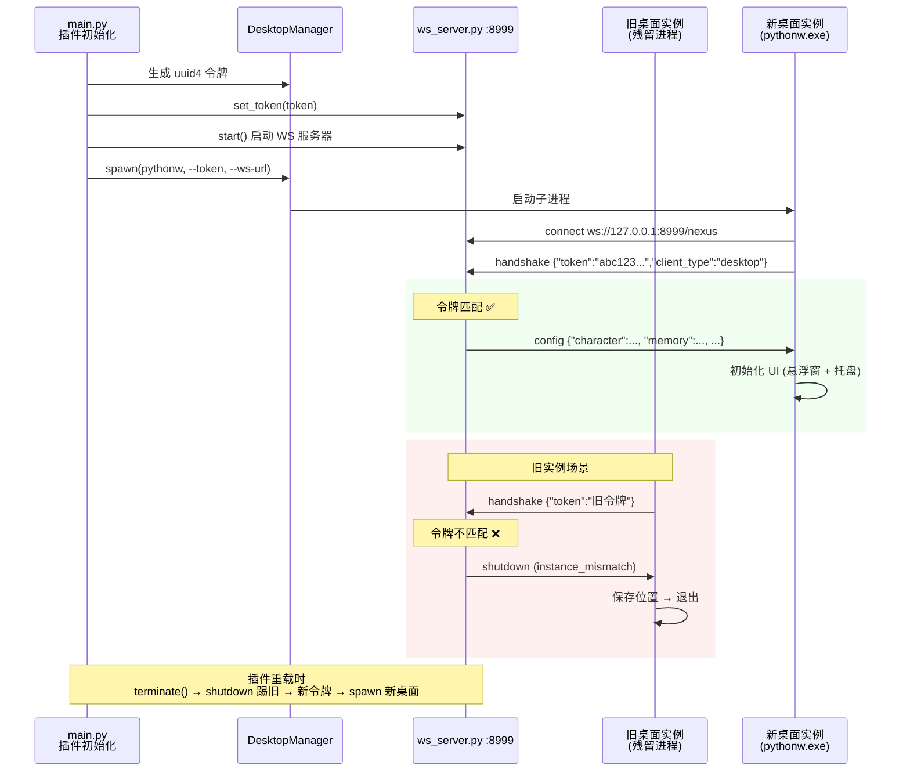

```text
                  🔐 令牌握手机制 — uuid4 替代 PID 文件

    插件初始化:
    ┌────────────┐  生成 uuid4   ┌──────────────────┐
    │ main.py    │──────────────▶│ DesktopManager    │
    └─────┬──────┘               └────────┬─────────┘
          │ set_token(token)              │ spawn(pythonw, --token)
          ▼                               ▼
    ┌──────────────┐            ┌──────────────────┐
    │ ws_server.py │            │ 桌面子进程        │
    │ :8999        │◀───────────│ pythonw.exe      │
    └──────┬───────┘  connect   └──────────────────┘
           │            handshake
           │  {"token":"abc...","client_type":"desktop"}
           │
    ╔══════╧══════════════════════════════════════════╗
    ║  令牌匹配?                                      ║
    ╠══════════════════════════════════════════════════╣
    ║  ✅ 匹配              ❌ 不匹配 (旧实例残留)     ║
    ║  ┌─────────────────┐  ┌──────────────────────┐  ║
    ║  │ 下发 config JSON │  │ shutdown              │  ║
    ║  │ 初始化 UI       │  │ (instance_mismatch)   │  ║
    ║  └─────────────────┘  │ 旧桌面保存位置 → 退出  │  ║
    ║                       └──────────────────────┘  ║
    ╚═════════════════════════════════════════════════╝

    插件重载流程:
      terminate() → shutdown 踢旧桌面
        → initialize() → 生成新令牌 → spawn 新桌面
```

**边界处理**：
- 插件重载 → terminate() 发 shutdown 踢旧桌面 → initialize() 新令牌 → spawn 新桌面
- 旧桌面未响应 → 新桌面用新令牌连接 → ws_server 验证通过 → 踢旧连接
- AstrBot Launcher 双 Python 进程 → `.desktop.lock` 文件锁跨进程互斥

---

## 3. 多平台消息路由

所有平台的消息统一流入 Brain 的 SessionManager，LLM 看到的是完整的跨平台对话历史。回复原路返回，不广播到其他平台。

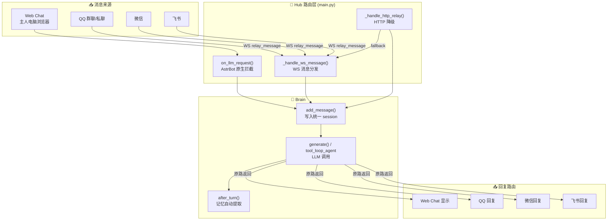

```text
                📡 多平台消息路由 — 统一 session · 原路返回

    输入                           Hub 路由                     Brain
    ────                           ────────                     ─────
    ┌──────────────┐               ┌──────────────────┐
    │ 💬 Web Chat  │──原生管线────▶│ on_llm_request() │
    │ :8080        │               └────────┬─────────┘
    └──────────────┘                        │
                                            ├──▶ ┌──────────────────────┐
    ┌──────────────┐  WS relay             │    │ add_message()         │
    │ 🐧 QQ Bot    │──────┐                │    │ 写入统一 session      │
    └──────────────┘      │                │    └──────────┬───────────┘
                          │                │               │
    ┌──────────────┐      ├──▶ ┌───────────┴───────────────▼───────────┐
    │ 💚 微信 Bot  │──────┤    │ generate() → tool_loop_agent          │
    └──────────────┘      │    │ System Prompt + 跨平台上下文 + 工具调用 │
                          ├───▶│                                        │
    ┌──────────────┐      │    └──────────┬────────────────────────────┘
    │ 🪶 飞书 Bot  │──────┘               │
    └──────────────┘                      ├──▶ ┌──────────────────────┐
                                          │    │ after_turn()          │
    ┌──────────────┐  HTTP fallback       │    │ 触发记忆自动提取      │
    │ HTTP API     │──────┘               │    └──────────────────────┘
    └──────────────┘                      │
                                          │
    输出                           回复原路返回 (不广播)
    ────                           ─────────────────
    Web Chat ◀── 回复              QQ ◀── 回复
                                   微信 ◀── 回复    飞书 ◀── 回复

    关键: 两边消息写入同一个 session，LLM 看到完整跨平台对话历史
          但回复只出现在当前对话的窗口，其他平台不显示
```

**关键设计**：
- QQ 消息走 `@filter.on_llm_request()` → AstrBot 原生 Agent 管线（完整 tool_loop_agent + 工具调用）
- 桌面/卫星 Bot 消息走 WS → 手动构造 AstrMessageEvent → tool_loop_agent
- 两边消息写入**同一个 session**，LLM 看到的上下文是完整的
- 回复各自原路返回——桌面端消息不显示在 QQ，QQ 消息不推到桌面

---

## 4. RAG 清洗与记忆追溯

AstrBot 的 `livingmemory` 插件通过 Faiss 向量检索注入相关记忆块。Nexus 在消息入口做清洗 + 日志追溯，确保 RAG 内容不污染 LLM 上下文的同时可调试。

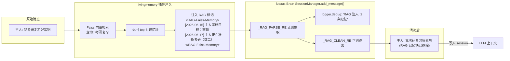

```text
              🔍 RAG 清洗与记忆追溯 — livingmemory 注入 → 正则剥离

    消息进入 SessionManager.add_message()
    ─────────────────────────────────────

    原始消息
    ┌────────────────────────────────────────────────────────────┐
    │ 主人: 我考研复习好累啊                                        │
    │ <RAG-Faiss-Memory>                                         │
    │   [2026-06-15] 主人考研目标：南邮                             │
    │   [2026-06-17] 主人正在准备考研（数二），需要武忠祥PDF         │
    │ </RAG-Faiss-Memory>                                        │
    └──────────┬─────────────────────────────────────────────────┘
               │
               ▼
    ┌──────────────────────┐
    │ _RAG_PARSE_RE        │──▶ logger.debug: "RAG 注入: 2 条记忆"
    │ 正则提取 RAG 内容     │    (可追溯，不丢弃信息)
    └──────────┬───────────┘
               │
               ▼
    ┌──────────────────────┐
    │ _RAG_CLEAN_RE        │──▶ <RAG-Faiss-Memory>...</RAG-Faiss-Memory>
    │ 正则剥离 RAG 标记     │    全部移除
    └──────────┬───────────┘
               │
               ▼
    清洗后消息
    ┌──────────────────────────────┐
    │ 主人: 我考研复习好累啊         │──▶ 写入 session → LLM 上下文
    └──────────────────────────────┘

    理想方案 (需改 livingmemory):
      Faiss top-20 → fastembed re-rank → top-5 → 去重(>0.9 只保留最新) → 注入
```

**RAG 结果顺序问题**（v0.5.1 识别）：Faiss 召回 top-5 后直接注入，无 re-rank、无去重。相近 embedding 的旧/新记忆混合注入，LLM 难以判断时间线。

**当前方案**：清洗 + 日志追溯。理想方案：`RAG 检索 top-20 → fastembed re-rank → 取 top-5 → 去重（相似度 >0.9 只保留最新）→ 注入`。需改 `livingmemory` 插件。

---

## 5. 记忆系统：三层安全网

v0.5.0 建立的递进式记忆保存体系。从轻量文本缓存到 LLM 深度提取再到崩溃保护，四层递进。

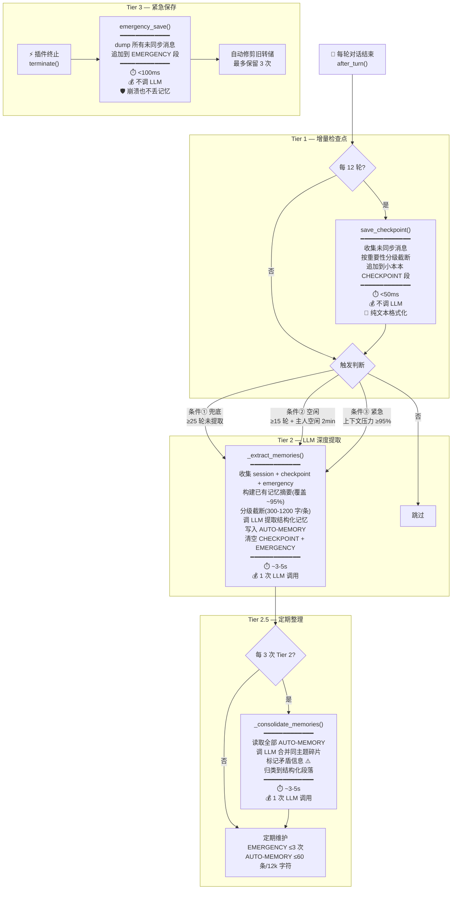

```text
            🧠 记忆系统：三层安全网 — 递进式记忆保存

    after_turn() 每轮触发
    │
    ├─ Tier 1 (每 12 轮) ⏱️ <50ms · 💰 免费
    │  ┌──────────────────────────────────────────┐
    │  │ save_checkpoint()                         │
    │  │ · 收集未同步消息                           │
    │  │ · 按重要性分级截断 (500-2000 字)           │
    │  │ · 追加到小本本 CHECKPOINT 段               │
    │  └──────────────────────────────────────────┘
    │
    ├─ Tier 2 (智能触发) ⏱️ ~3-5s · 💰 1 次 LLM
    │  ┌──────────────────────────────────────────┐
    │  │ 触发条件 (满足任一):                       │
    │  │ ① 兜底: ≥25 轮未提取                      │
    │  │ ② 空闲: ≥15 轮 + 主人 2min 未说话         │
    │  │ ③ 紧急: 上下文压力 ≥95%                   │
    │  │──────────────────────────────────────────│
    │  │ _extract_memories()                       │
    │  │ · 收集 session + checkpoint + emergency   │
    │  │ · 构建已有记忆摘要 (覆盖 ~95%)              │
    │  │ · 分级截断 (300-1200 字/条)                │
    │  │ · LLM 提取 → AUTO-MEMORY                  │
    │  │ · 清空 CHECKPOINT + EMERGENCY              │
    │  └──────────────────────────────────────────┘
    │
    ├─ Tier 2.5 (每 3 次 Tier 2) ⏱️ ~3-5s · 💰 1 次 LLM
    │  ┌──────────────────────────────────────────┐
    │  │ _consolidate_memories()                   │
    │  │ · LLM 合并同主题碎片 → 连贯段落           │
    │  │ · 标记矛盾信息 ⚠️                         │
    │  │ · 归类到结构化段落                        │
    │  └──────────────────────────────────────────┘
    │
    └─ Tier 3 (插件终止) ⏱️ <100ms · 💰 免费
       ┌──────────────────────────────────────────┐
       │ emergency_save()                          │
       │ · dump 所有未同步消息 → EMERGENCY 段       │
       │ · 崩溃也不丢记忆 🛡️                        │
       │ · 自动修剪旧转储 (保留 3 次)               │
       └──────────────────────────────────────────┘
```

**状态追踪**：

| 状态变量 | 用途 |
|----------|------|
| `_total_user_turns` | 永不重置的绝对轮次计数器（不因 deque 截断倒退） |
| `_last_synced_turn` | 上一次 Tier 2 LLM 提取的轮次 |
| `_last_checkpoint_turn` | 上一次 Tier 1 检查点的轮次 |
| `_last_user_message_time` | 最后一条用户消息时间戳（空闲检测） |
| `_llm_extraction_count` | Tier 2 累计次数（触发 Tier 2.5） |

---

## 6. 记忆系统：四阶段质量优化

v0.5.1 针对主人反馈的三大痛点（碎片化、覆盖/RAG 混乱、压缩率过高）实施的系统性优化。

```mermaid
flowchart LR
    subgraph PhaseA["Phase A: 去重 + 版本化 + RAG 追溯"]
        direction TB
        A1["_build_existing_memory_summary()<br/>全部已有记忆 → 结构化摘要<br/>覆盖 ~95% (旧方案仅 ~30%)"]
        A2["_generate_memory_id()<br/>每条记忆 [mem-YYYYMMDD-NNN]<br/>唯一 ID + 时间戳"]
        A3["_RAG_PARSE_RE + add_message()<br/>RAG 注入可追溯日志"]
    end

    subgraph PhaseB["Phase B: 重要性评分 + 分级截断"]
        direction TB
        B1["_score_message_importance()<br/>关键词 · 长度 · 情感<br/>三维评分 0.0-1.0"]
        B2["_truncate_by_importance()<br/>Tier1: 500-2000 字<br/>Tier2: 300-1200 字"]
        B3["压缩参数调优<br/>CHECKPOINT 8→12<br/>SYNC 12→15<br/>MAX_TURNS 50→80"]
    end

    subgraph PhaseC["Phase C: 定期整理 + 语义去重"]
        direction TB
        C1["Tier 2.5 每 3 次提取后<br/>LLM 合并同主题碎片<br/>标记过时/矛盾信息"]
        C2["_find_similar_existing()<br/>difflib.SequenceMatcher<br/>相似度 >0.85 去重"]
    end

    subgraph PhaseD["Phase D: AUTO-MERGE"]
        direction TB
        D1["- [段落名] [AUTO] 事实<br/>高置信度自动合并<br/>直接写入目标段落"]
        D2["- [段落名] 事实<br/>低置信度 → MERGE 段<br/>等待主人审核"]
    end

    PhaseA --> PhaseB --> PhaseC --> PhaseD
```

```text
        🧠 记忆质量优化 — 四阶段递进 (v0.5.1)

    Phase A ──────▶ Phase B ──────▶ Phase C ──────▶ Phase D
    去重+版本化     重要性评分      定期整理        AUTO-MERGE

    ┌────────────┐ ┌────────────┐ ┌────────────┐ ┌────────────┐
    │ 结构化摘要  │ │ 三维评分    │ │ Tier 2.5   │ │ [AUTO]     │
    │ 覆盖 ~95%  │ │ 关键词     │ │ 合并碎片   │ │ 高置信度   │
    │            │ │ +长度      │ │ 标记矛盾   │ │ 自动合并   │
    │ 记忆 ID    │ │ +情感      │ │            │ │            │
    │ [mem-...]  │ │            │ │ 语义去重   │ │ [段落名]   │
    │ 版本化     │ │ 分级截断   │ │ >0.85      │ │ 低置信度   │
    │            │ │ 500-2000字 │ │            │ │ →MERGE 段  │
    │ RAG 日志   │ │            │ │            │ │ 等待审核   │
    │ 可追溯     │ │ 参数调优   │ │            │ │            │
    └─────┬──────┘ └─────┬──────┘ └─────┬──────┘ └─────┬──────┘
          │              │              │              │
          ▼              ▼              ▼              ▼
    去重 30→95%    损耗 95→60%   碎片化 ↓70%   手动整理 ↓80%
```

**痛点 → 方案对照**：

| 痛点 | 根因 | 方案 | 效果 |
|------|------|------|------|
| ① 碎片化 | 平铺 bullet + MERGE 需手动 + 无定期整理 | Phase C + D | 碎片化 ↓60-70% |
| ② 覆盖/RAG 混乱 | 去重窗口仅 2000 字符 + 无 ID + 无 re-rank | Phase A | 去重覆盖 30→95% |
| ③ 压缩率过高 (95%) | 一刀切截断 500/300 字 + 无重要性分级 | Phase B | 损耗 95→60% |

---

## 7. 小本本段管理

`安绪的小本本.md` 是 Markdown 格式的长期记忆文件。主人手写结构化段落（👤 主人信息、🐱 安绪的信息 等），AI 自动提取追加到标记段。NotebookIO 负责所有文件读写。

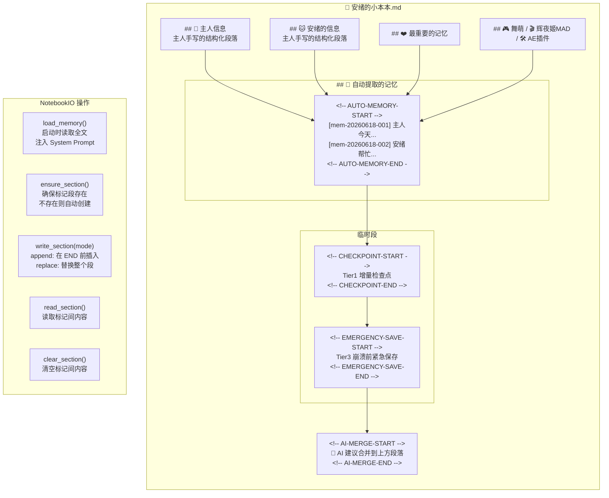

```text
              📓 小本本段管理 — 4 个标记段 + 5 个 I/O 操作

    安绪的小本本.md
    ═══════════════════════════════════════════════════════
    ## 👤 主人信息           ← 主人手写的结构化段落
    ## 🐱 安绪的信息          ← 主人手写的结构化段落
    ## ❤️ 最重要的记忆
    ## 🎮 舞萌 / 🎬 辉夜姬MAD / 🛠️ AE插件
    ═══════════════════════════════════════════════════════
    ## 🤖 自动提取的记忆
    <!-- AUTO-MEMORY-START -->  ← Tier 2 LLM 提取写入
      [mem-20260618-001] ...    持久 · 容量控制修剪
      [mem-20260618-002] ...
    <!-- AUTO-MEMORY-END -->
    ═══════════════════════════════════════════════════════
    <!-- CHECKPOINT-START -->   ← Tier 1 检查点写入
      ...                       临时 · Tier2 提取后清空
    <!-- CHECKPOINT-END -->
    ═══════════════════════════════════════════════════════
    <!-- EMERGENCY-SAVE-START -->← Tier 3 紧急保存写入
      ...                       临时 · 最多保留 3 次
    <!-- EMERGENCY-SAVE-END -->
    ═══════════════════════════════════════════════════════
    <!-- AI-MERGE-START -->      ← Tier 2 解析写入
      🔄 AI 建议合并到上方段落   累积 · 等待主人审核
    <!-- AI-MERGE-END -->

    NotebookIO 5 个操作:
      load_memory()    ensure_section()  write_section()
      read_section()   clear_section()
```

**四个标记段**：

| 标记段 | 写入者 | 内容 | 生命周期 |
|--------|--------|------|---------|
| `AUTO-MEMORY` | Tier 2 LLM 提取 | 结构化长期记忆，每条带 `[mem-ID]` | 持久，Tier 2.5 整理，容量控制修剪 |
| `CHECKPOINT` | Tier 1 增量检查点 | 原始对话摘要 | 临时，Tier 2 提取后清空 |
| `EMERGENCY` | Tier 3 紧急保存 | 崩溃前未同步消息 | 临时，Tier 2 提取后清空，最多保留 3 次 |
| `AI-MERGE` | Tier 2 解析 | AI 建议合并到上方段落 | 累积，等待主人手动审核 |

---

## 8. 容量控制

v0.6.1 新增，防止小本本无限膨胀。独立于 LLM 的修剪路径，不依赖 Tier 2 触发。

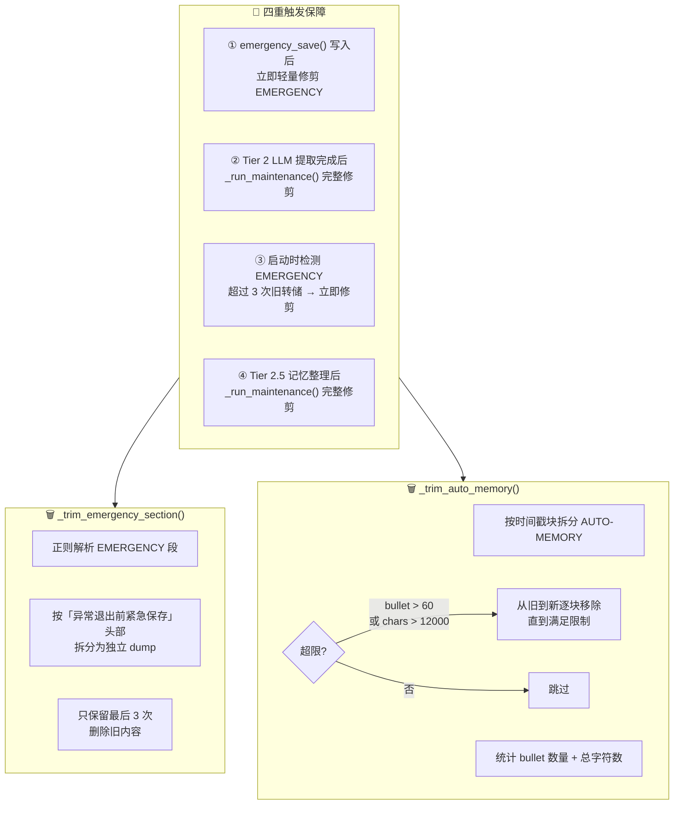

```text
             🗑️ 容量控制 — 防止小本本无限膨胀 (v0.6.1)

    四重触发保障:
    ┌─────────────────────────────────────────────────────┐
    │ ① emergency_save() 后  → 立即轻量修剪 EMERGENCY     │
    │ ② Tier 2 LLM 提取后   → _run_maintenance() 完整修剪 │
    │ ③ 启动时检测          → EMERGENCY >3 次 → 立即修剪  │
    │ ④ Tier 2.5 整理后     → _run_maintenance() 完整修剪 │
    └─────────────────────────────────────────────────────┘

    _trim_emergency_section()          _trim_auto_memory()
    ┌─────────────────────────┐       ┌─────────────────────────┐
    │ 正则解析 EMERGENCY 段    │       │ 按时间戳块拆分           │
    │ 按「异常退出前」头部拆分  │       │ 统计 bullet 数 + 总字符  │
    │ 只保留最后 3 次          │       │ bullet > 60 ?            │
    │ 删除旧内容               │       │ chars > 12000 ?          │
    └─────────────────────────┘       │ 逐块移除最旧的           │
                                      └─────────────────────────┘

    限制: MAX_EMERGENCY_DUMPS=3 · AUTO_MEMORY_MAX_BULLETS=60 · AUTO_MEMORY_MAX_CHARS=12000
```

**限制常量**：

| 常量 | 值 | 说明 |
|------|------|------|
| `MAX_EMERGENCY_DUMPS` | 3 | 最多保留最近 3 次紧急转储 |
| `AUTO_MEMORY_MAX_BULLETS` | 60 | 最多保留 60 条 bullet |
| `AUTO_MEMORY_MAX_CHARS` | 12000 | 自动记忆段软上限 |

---

## 9. Brain 模块拆分 (v0.7.0-dev)

原 brain.py 经过 9 次迭代从 ~200 行膨胀到 1650 行，承载 7 种职责。2026-06-18 拆为 6 模块的 `brain/` 包。

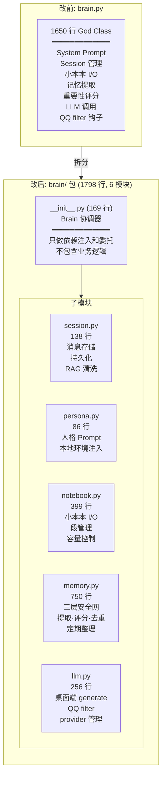

**依赖关系**：

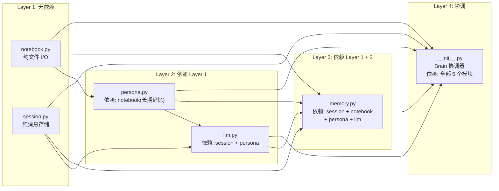

```text
          🔧 Brain 模块拆分 — 1650 行 God Class → 6 模块包 (v0.7.0-dev)

    改前: brain.py (1 文件)              改后: brain/ 包 (6 文件)
    ════════════════════════            ════════════════════════
    ┌─────────────────────┐            ┌─────────────────────┐
    │ Brain (1650 行)     │            │ __init__.py (169 行) │ ← 协调器
    │                     │            │ 只做依赖注入和委托   │
    │ System Prompt ──────┼──▶         └──┬──┬──┬──┬──┬─────┘
    │ Session 管理 ───────┼──▶            │  │  │  │  │
    │ 长期记忆加载 ───────┼──▶    ┌───────┘  │  │  │  └──────┐
    │ 三层安全网 ─────────┼──▶    ▼          ▼  ▼  ▼         ▼
    │ 消息重要性评分 ─────┼──▶  session  persona notebook memory llm
    │ LLM 提取+去重 ─────┼──▶  (138)   (86)    (399)   (750) (256)
    │ Tier 2.5 整理 ─────┼──▶
    │ 小本本段管理 ──────┼──▶  自底向上依赖:
    │ 容量控制 ──────────┼──▶  Layer 1: notebook, session (无依赖)
    │ QQ filter 钩子 ────┼──▶  Layer 2: persona, llm (依赖 L1)
    │ 桌面端 LLM 调用 ───┼──▶  Layer 3: memory (依赖 L1+L2)
    └─────────────────────┘      Layer 4: __init__ (依赖全部)
```

**向后兼容**：`main.py` 无需改动。`from .brain import Brain` 自动解析到 `brain/__init__.py`。所有 17 个 `self.brain.*` 访问点验证通过。

---

## 10. WS 重连机制

v0.6.2 建立的心跳检测 + 指数退避重连。桌面端与 Hub 断开后自动恢复，无需用户干预。

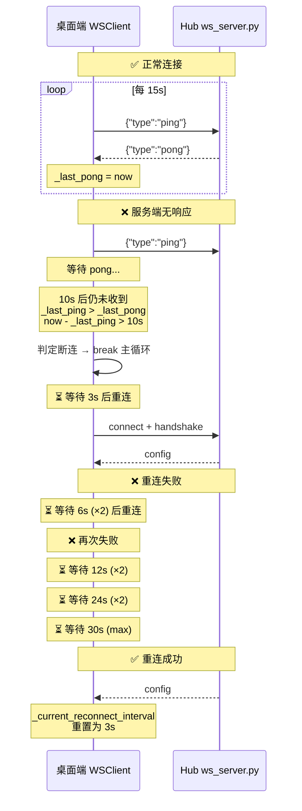

```text
            💓 WS 重连机制 — 心跳检测 + 指数退避 (v0.6.2)

    正常状态:
    ┌──────────┐ 每 15s           ┌──────────────┐
    │ 桌面端    │──── ping ──────▶│ Hub WS Server │
    │ WSClient │◀─── pong ───────│ :8999         │
    └──────────┘ 10s 内收到       └──────────────┘

    断连检测:
    ┌──────────┐                  ┌──────────────┐
    │ 桌面端    │──── ping ──────▶│ (无响应)      │
    │ _last_ping│                  │              │
    │ >_last_pong                 │              │
    │ &&        │  10s 未收到 pong │              │
    │ now-ping  │  → 主动断开      │              │
    │ > 10s     │                  │              │
    └──────────┘                  └──────────────┘

    指数退避重连:
    断开 ──3s──▶ 重连失败 ──6s──▶ 失败 ──12s──▶ 失败 ──24s──▶ 失败 ──30s──▶ ...
                                ↑ 每次 ×2                        ↑ 封顶

    连接成功 → _current_reconnect_interval 重置回 3s

    🐛 Bug 修复 (v0.6.2.1):
    初始 _last_ping == _last_pong → 首个 ping 15s 才发但超时 10s 误触发
    改为: 仅 _last_ping > _last_pong 时检查超时
```

**心跳参数**：

| 参数 | 值 | 说明 |
|------|------|------|
| `HEARTBEAT_INTERVAL` | 15s | 每 15 秒发一次 ping |
| `HEARTBEAT_TIMEOUT` | 10s | 超时未收到 pong → 断连 |
| `INITIAL_RECONNECT_INTERVAL` | 3s | 初始重连等待 |
| `MAX_RECONNECT_INTERVAL` | 30s | 最大重连等待 |
| `BACKOFF_MULTIPLIER` | 2.0 | 每次失败翻倍 |

**心跳 Bug 修复 (v0.6.2.1)**：初始 `_last_ping == _last_pong`（都设成连接时间），首个 ping 要 15s 才发但超时检查 10s 就误触发。改为仅 `_last_ping > _last_pong`（已发 ping 但未收到对应 pong）时才检查超时。

---

## 11. 桌面端

桌面端是 PyQt5 子进程（pythonw.exe，无黑窗），由 DesktopManager 管理生命周期。当前只实现了 Layer 1（迷你悬浮窗），Layer 2/3 迁至 Nexus_Desktop。

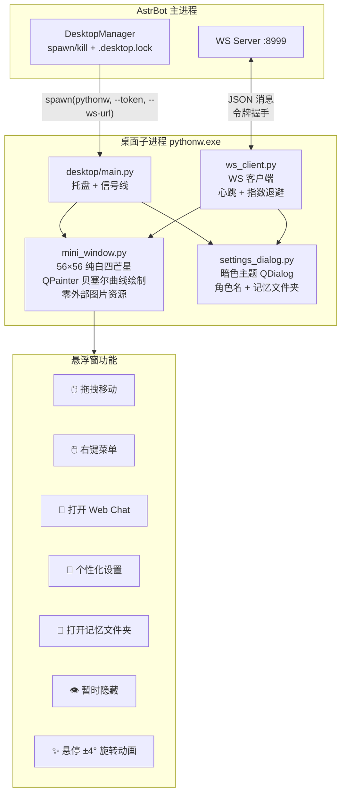

```text
                🖥️ 桌面端 — PyQt5 子进程 · 纯表演层

    AstrBot 主进程                           桌面子进程 (pythonw.exe)
    ════════════                            ═════════════════════════
    ┌────────────────┐  spawn(pythonw,     ┌─────────────────────────┐
    │ DesktopManager │  --token, --ws-url) │ desktop/main.py         │
    │ · 生成令牌     │───────────────────▶│ · 系统托盘 QSystemTray  │
    │ · .desktop.lock│                    │ · 右键菜单              │
    └────────────────┘                    │ · 信号线 wiring         │
                                          └──┬──────────┬───────────┘
    ┌────────────────┐  WS :8999            │          │
    │ ws_server.py   │◄═════════════════════┼──────────┘
    │ · 令牌验证     │  JSON 消息           │
    │ · config 下发  │  心跳 ping/pong     ┌▼───────────────────┐
    └────────────────┘                    │ mini_window.py      │
                                          │ 56×56 纯白 #FFFFFF  │
                                          │ 蓝 #5B9BD5 四芒星   │
    ┌────────────────┐                    │ QPainter 贝塞尔曲线 │
    │ 个性化设置      │◄──────────────────│ 悬停 ±4° 旋转动画   │
    │ 对话框 ────────┼──────────────────▶│ 拖拽 · 右键菜单     │
    └────────────────┘  update_config     └─────────────────────┘
                                          ┌─────────────────────┐
                                          │ settings_dialog.py   │
                                          │ 角色名 QLineEdit     │
                                          │ 记忆文件夹 选择      │
                                          │ 实时联动提示         │
                                          └─────────────────────┘

    悬浮窗功能: 拖拽 · 右键菜单 · 打开WebChat · 个性化设置 · 记忆文件夹 · 隐藏 · 退出
```

**悬浮窗设计 (v0.6.0)**：
- 56×56 纯白底盘 `#FFFFFF` + 蓝色四芒星 `#5B9BD5`
- QPainter 贝塞尔曲线 8 顶点多边形，零外部图片资源
- 手绘偏移暗圈模拟阴影（替代不兼容 `WA_TranslucentBackground` 的 `QGraphicsDropShadowEffect`）
- `QPropertyAnimation` ±4° 旋转悬停动画（1.0s 周期，InOutSine 缓动）

---

## 12. 版本演进总览

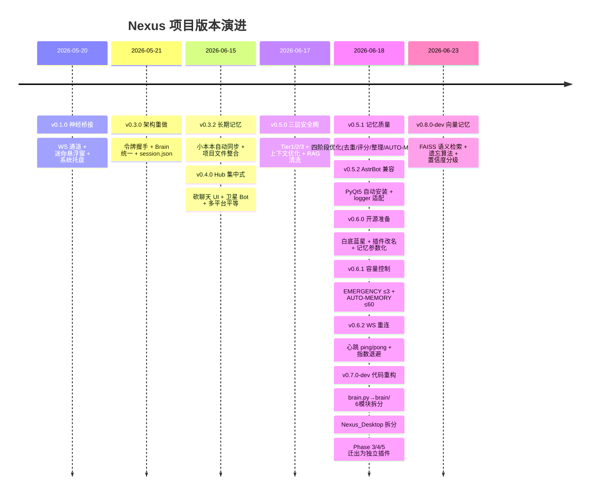

> **v0.8.0 设计参考**: [Iris Chat Memory](https://github.com/leafliber/astrbot_plugin_iris_memory) — Smart 3 tier long term memory, completed memory circle.
> Iris 的三层记忆架构（L1 Buffer → L2 FAISS → L3 知识图谱）、遗忘评分算法、梦境离线加工流水线为 Nexus v0.8.0 的向量化改造提供了核心设计参考。

```
Nexus_brain 进度  ████████████████████ 100%  ← Hub 大脑 v0.8.0 ✅
Nexus_Desktop      ░░░░░░░░░░░░░░░░░░░░   0%  ← 新插件待开工
═══════════════════════════════════════════════
总体               █████████████████░░░  92%
```

---

## 13. v0.8.0 向量记忆系统

> **设计参考**: [Iris Chat Memory](https://github.com/leafliber/astrbot_plugin_iris_chat_memory) by Leafliber — Smart 3 tier long term memory, completed memory circle.

v0.8.0 参考 Iris 的三层记忆架构和遗忘算法，对 Nexus 记忆系统进行了根本性升级。

### 13.1 架构对比

```text
              改前 (v0.7.0)                          改后 (v0.8.0)
              ═══════════                            ═══════════

  AUTO-MEMORY (.md 文本)                 AUTO-MEMORY (.md 文本) ← 人类可读备份
       │                                        │
       │ 全量注入                                │ 双写
       ▼                                        ▼
  System Prompt                          FAISS 向量索引 ← 语义检索
  (60条上限，再多塞不下)                        │
                                               │ top-K 检索
                                               ▼
                                         System Prompt
                                         (按相关性注入，不受条数限制)
```

### 13.2 新增模块

| 文件 | 行数 | 功能 |
|------|------|------|
| `brain/vector_memory.py` | ~450 行 | FAISS 向量存储 + 语义检索 + 遗忘评分算法 |

### 13.3 改动模块

| 文件 | 变更 | 内容 |
|------|------|------|
| `brain/memory.py` | +200 行 | 双写 (.md+FAISS)、置信度分级提取 prompt、遗忘维护、`retrieve_relevant_memories()` API |
| `brain/persona.py` | +70 行 | `build_async()` 语义检索注入、token 预算控制 |
| `brain/__init__.py` | +30 行 | `VectorMemoryStore` 初始化 + wiring |
| `main.py` | +40 行 | `_init_vector_memory()` 零配置自动初始化 |

### 13.4 核心特性

#### 13.4.1 向量化语义检索

```text
旧: 所有记忆全量注入 System Prompt（上限 60 条 / 12000 字符）
新: FAISS 语义检索 → top-10 相关记忆 → 注入 System Prompt
    嵌入: BAAI/bge-small-zh-v1.5 (本地 512 维，零配置自动下载)
    降级: TF-IDF 文本匹配 → 字符级编码（零依赖也能跑）
```

#### 13.4.2 遗忘评分算法

```
旧: bullet > 60 或 chars > 12000 → 从旧到新逐块裁剪
新: S = 0.30·R + 0.40·C + 0.30·F

    R (近因性): exp(-0.08 × 距上次访问天数)  — 衰减极慢，旧记忆也珍贵
    C (置信度): [HIGH]=0.90 / [MEDIUM]=0.70 / [LOW]=0.40
    F (频率):   log(访问次数+1) / log(101)

    保护规则:
    - 置信度 ≥ 0.85 + 被访问过 → 永不淘汰
    - 7 天内新记忆 → 永不淘汰
    - S < 0.08 → 立即淘汰
    - S < 0.25 + 超 30 天保留期 → 候选淘汰

对比 Iris 遗忘算法:
  Iris: S = 0.40·R + 0.35·F + 0.25·C + 0.0·(1-D)
  Nexus: S = 0.30·R + 0.40·C + 0.30·F
  Nexus 调高了置信度权重 (0.40 vs 0.25)，降低了近因性 (0.30 vs 0.40)，
  因为单用户场景中旧记忆和主人明确陈述的事实比群聊场景更重要。
```

#### 13.4.3 置信度分级

```
Tier 2 LLM 提取 prompt 新增要求:

[HIGH]   = 主人明确陈述的事实 (confidence=0.90)
          "主人说他的考研目标是南邮"
[MEDIUM] = 合理推断或一般性信息 (confidence=0.70)
          "主人最近经常提到想学 Rust"
[LOW]    = 模糊或推测性信息 (confidence=0.40)
          "主人可能对XX有点兴趣"

影响:
  - 高置信度记忆受遗忘算法保护
  - 低置信度记忆加速淘汰
  - System Prompt 注入时标注来源置信度
```

#### 13.4.4 零配置嵌入方案

```
优先级 1: sentence-transformers (BAAI/bge-small-zh-v1.5)
         → 首次自动下载 ~100MB，之后完全离线
优先级 2: TF-IDF 文本匹配 (scikit-learn)
         → 纯数学，零下载
优先级 3: 字符级编码 (纯 numpy)
         → 零依赖终极降级
```

### 13.5 Iris 参考对照

| Iris 特性 | Nexus 采纳 | 说明 |
|-----------|-----------|------|
| L2 FAISS 向量检索 | ✅ 采纳 | `VectorMemoryStore` 核心功能 |
| 遗忘评分算法 | ✅ 采纳 + 调优 | 权重针对单用户场景调整 |
| 置信度分级 | ✅ 采纳 | high/medium/low 三级 |
| 查询改写 | 🔜 P1-3 | Phase 2 计划 |
| L3 知识图谱 | 🔜 P2-1 | Phase 4 计划 |
| 梦境离线加工 | 🔜 P1-2 | Phase 3 计划 |
| 用户画像自动化 | 🔜 P0-3 | Phase 2 计划 |
| LLM 主动记忆工具 | 🔜 P1-1 | Phase 2 计划 |
| Web 管理面板 | 🔜 P2-2 | 长期计划 |
| 图片记忆 | 🔜 P2-4 | 长期计划 |
| 多用户/群聊隔离 | ❌ 不适用 | Nexus 是单用户桌面伴侣 |

### 13.6 验证状态

```
✅ FAISS 索引初始化: 24 条向量
✅ 本地嵌入模型: BAAI/bge-small-zh-v1.5 (512 维)
✅ 从小本本同步: 24 条记忆 → 向量存储
✅ 语法检查: 6/6 文件通过
✅ 端到端运行: AstrBot v4.25.5 加载成功
```

---

## A. 附录：原始更新日志

> 以下为原始更新日志的完整备份，按时间倒序。每条记录对应一个 git commit。

### 2026-06-23

- **🧠 v0.8.0-dev 向量记忆系统**（设计参考 [Iris Chat Memory](https://github.com/leafliber/astrbot_plugin_iris_chat_memory)）：新增 `brain/vector_memory.py` (~450 行) — FAISS 语义检索替代全量注入、遗忘评分算法替代纯时间裁剪、置信度分级 (HIGH/MEDIUM/LOW)。修改 `brain/memory.py` (+200 行) 双写 .md+FAISS、`brain/persona.py` (+70 行) 语义检索注入、`brain/__init__.py` (+30 行) wiring、`main.py` (+40 行) 零配置初始化。嵌入方案: BAAI/bge-small-zh-v1.5 本地模型自动下载。

### 2026-06-20

- **🔒 .gitignore 隐私漏洞修复**：`memory.md` 规则与实际命名 `{角色名}的小本本.md` 不匹配，开源前发现并修复。`Nexus_brain/.gitignore` 新增 `*小本本.md` glob，`记忆/.gitignore` 新建，忽略小本本 + 私人图片。

### 2026-06-18

- **🔌 WS 重连优化：心跳检测 + 指数退避**：`ws_server.py` 新增 ping→pong 响应；`desktop/ws_client.py` 心跳每 15s 发 ping，10s 无 pong→断连；指数退避 3s→6s→12s→24s→30s(max)。总计 ~60 行。
  - **🐛 心跳超时 Bug 修复**：初始 `_last_ping == _last_pong`，首个 ping 15s 才发但超时检查 10s 就触发。改为仅 `_last_ping > _last_pong` 时检查超时。
- **🧹 小本本容量控制**：`MAX_EMERGENCY_DUMPS=3`、`AUTO_MEMORY_MAX_BULLETS=60`、`AUTO_MEMORY_MAX_CHARS=12000`。`_trim_emergency_section()` + `_trim_auto_memory()` + `_run_maintenance()`。四重触发保障。brain.py 净增 ~170 行。
- **🔧 悬浮窗打开 Web Chat 改为激活 Launcher**：`subprocess.Popen` 启动 `astrbot-launcher.exe`，Electron 单实例锁自动弹到前台。净减 ~40 行。
- **🌐 v0.6.0 开源准备**：悬浮窗 56×56 纯白四芒星 + 个性化设置 + 插件改名 + 记忆参数化 + 隐私保护。14 文件修改，3 新文件，~500 行。
- **🧠 v0.5.1 记忆质量优化（四阶段完成）**：Phase A 去重+版本化+RAG追溯、Phase B 重要性评分+分级截断、Phase C 定期整理+语义去重、Phase D AUTO-MERGE。brain.py 净增 ~200 行。
- **🔀 Nexus_Desktop 拆分**：Phase 3/4/5 迁出为独立插件。
- **🔧 brain.py→brain/ 代码重构**：1650 行拆为 6 模块。

### 2026-06-17

- **🧠 记忆系统重构：三层安全网 + 上下文优化**：Tier 1/2/3 + `max_context_tokens` 100万→128000 + 删除 `simple_long_memory` + `turn_count`→`_total_user_turns`。
- **🧠 v0.5.0 修复计划**：self_evolution 插件流式兼容性诊断。① `send_sticker` LLM Tool 私链返回空→`yield` 反馈；② 14 处 `call_action` + `hasattr` 守卫；③ System Prompt 格式注入 + `on_decorating_result` 流式分流。

### 2026-06-15

- **🎯 v0.4.0 架构重设计**：Hub 集中式多平台大脑 + 表演层桌宠。项目文件整合到 `安绪_Nexus/`。
- **长期记忆系统 + 自动同步**：`_load_long_term_memory()` + `after_turn()` + `_extract_memories()` + `_write_auto_memories()`。
- **修复 QQ 端工具调用失效**：System Prompt 注入工具指令 + LLM「云端 AI」幻觉修复。
- **修复 Web Chat 工具调用 Permission denied**：`event.role = "admin"`。

### 2026-05-21

- **v0.3.0 架构重做**：令牌握手替代 PID 文件 + taskkill + netstat。`brain.py` 合并三模块。`desktop_manager.py` 干净子进程管理。`session.json` 持久化。
- **桌面端日志接入平台**：stderr→PIPE 捕获，守护线程转发 AstrBot logger。
- **双目录陷阱修复**：Directory Junction 同步编辑目录与实例目录。
- **修复 provider not found**：`_resolve_provider_id()` 从默认配置获取。

### 2026-05-20

- 项目方向调整：nexus-client→neko_brain 插件子模块。NEKO 功能对标。桌面端工具调用修复。架构重构方案制定。
