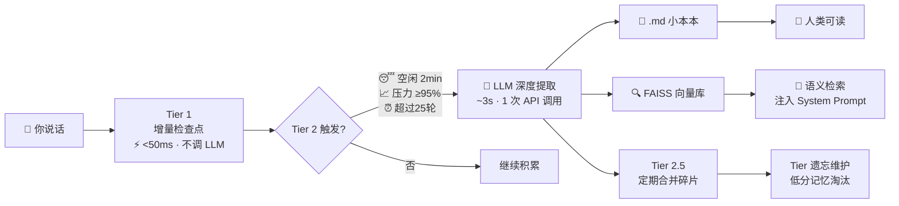

# 🧠 Project Nexus —— 你的 AI 桌面伴侣大脑喵~！

<p align="center">
  <i>「不管你在 QQ、微信还是飞书上找我，我都记得住你哦！」</i>
</p>

---

> **AstrBot 插件** · Hub 集中式多平台 AI 大脑 · FAISS 向量记忆 · 遗忘算法 · 置信度分级

**v0.8.0-dev** — 让你的 Bot 真正拥有「记忆」喵~

---

## ✨ 这是什么？

普通的 QQ Bot、微信 Bot、飞书 Bot 都有一个致命问题——**它们是三个人**。

你在 QQ 上告诉它「我明天考数二」，打开微信之后它一脸茫然问你「主人今天有什么安排吗」。飞书上它甚至不知道你是个考研人。

**Nexus 的解法很简单：只给 AI 一个大脑。**

```
          ┌──────────────┐
  QQ ───→ │              │
微信 ───→ │  🧠 Brain   │ ───→ 回复（原路返回）
飞书 ───→ │  (唯一大脑)  │
Web ───→ │              │
          └──────┬───────┘
                 │
            📓 小本本 + 🔍 FAISS 向量库
                 │
            所有记忆共享
```

所有平台的消息汇聚到同一个 Hub 实例的同一个 Brain 对象。LLM 看到的是完整的跨平台对话历史，回复原路返回不广播到其他平台。**不是三个 Bot，是同一个 AI。**

---

## 🎮 核心能力

| 能力 | 说明 |
|------|------|
| 🧠 **三层安全网记忆** | Tier 1 增量检查点 → Tier 2 LLM 深度提取 → Tier 3 紧急保存，层层递进不丢记忆 |
| 🔍 **FAISS 语义检索** | 你说「上次那个游戏」能向量匹配到「舞萌」，不再全量注入 System Prompt |
| 📊 **遗忘算法** | `S = 0.30·R + 0.40·C + 0.30·F`，不是傻傻「旧了就删」，而是数学公式算分 |
| 🏷️ **置信度分级** | HIGH / MEDIUM / LOW 三级，重要的事永远不会忘 |
| 💬 **跨平台统一大脑** | QQ、微信、飞书、WebChat 共享 100% 对话上下文和记忆 |
| 📓 **Markdown 小本本** | 人类可读的记忆文件 + FAISS 双写，主人可以手写、AI 自动追加 |
| 🖥️ **56×56 四芒星悬浮窗** | QPainter 贝塞尔曲线绘制，零外部图片，右键个性化设置 |
| 🔐 **本地优先** | 所有对话数据跑在你自己的电脑上，不经过任何云端 |

---

## 🧠 记忆系统架构

论文第 5 章详述了整个记忆系统的演进，这里画个喵喵能看懂的版本：



### 各层详细说明

**Tier 1 · 增量检查点** — 每 12 轮对话，纯文本格式化追加到小本本 CHECKPOINT 段。不调 LLM，耗时 <50ms，零 API 费用。按消息重要性动态截断（500-2000 字）。

**Tier 2 · LLM 深度提取** — 三维智能触发：(1) 主人空闲超过 2 分钟；(2) 上下文压力达到 95%；(3) 超过 25 轮未提取（兜底）。LLM 从累积对话中提取结构化记忆，**标注置信度**后双写到 .md 文件和 FAISS 向量索引。

**Tier 2.5 · 定期整理** — 每 3 次 Tier 2 后触发，LLM 合并同主题碎片、标记矛盾信息、归类到结构化段落。

**Tier 3 · 紧急保存** — 插件关闭/崩溃前 <100ms 内 dump 所有未处理消息。死也不丢记忆！

---

## 🧮 遗忘算法

不是「存满 60 条就删最旧的」那种简单粗暴。借鉴人类记忆的遗忘曲线，每条记忆有一个**遗忘评分**：

```
S = 0.30 × 近因性(R) + 0.40 × 置信度(C) + 0.30 × 频率(F)

R = exp(-0.08 × 距上次访问天数)    ← 指数衰减，但 λ=0.08 衰减很慢
F = log(访问次数 + 1) / log(101)   ← 对数归一化
C = 记忆提取时的置信度评分           ← [HIGH]=0.90 [MEDIUM]=0.70 [LOW]=0.40
```

**为什么要这样设计权重？**

对比群聊机器人（如 Iris Chat Memory 的 0.40/0.35/0.25），桌面伴侣场景故意调低了近因性、拉高了置信度——因为「妈妈的生日是 5 月 20 日」这种主人明确说过的事实，哪怕三个月没再提起，也应该被记住。

| 保护规则 | 说明 |
|----------|------|
| 🛡️ 置信度 ≥ 0.85 + 被访问过 | **永不淘汰** |
| 🐣 7 天内新记忆 | **永不淘汰** |
| 💀 评分 < 0.08 | **立即淘汰** |
| ⚠️ 评分 < 0.25 + 超 30 天 | **候选淘汰** |
| 🔄 遗忘维护周期 | 每 6 小时一次，每次最多淘汰 10 条 |

---

## 🏗 系统架构（论文第 4 章精华版）

论文提出了四个核心设计原则，这里摘录喵~

### 原则一：统一大脑

AI 的人格定义、对话记忆和 LLM 调用逻辑在系统中**只有一份物理拷贝**。所有平台消息写入同一个 `session.json`，LLM 看到的上下文完整且一致。这是架构层面的「单一真相源」。

### 原则二：通道独立回复

各平台回复只发回对应平台——QQ 消息不出现在微信，桌面私密对话不泄漏到群聊。**有一个例外**：表演指令（表情/动作）通过 WebSocket 推送到悬浮窗。

### 原则三：表演分离

悬浮窗不承载文本输入——聊天全部走 Web Chat。桌面端代码不包含 LLM 调用、会话管理或文本处理逻辑，是一个纯粹的视觉客户端。

### 原则四：插件化部署

完整生命周期绑定在 AstrBot 插件上。启用→自动启动悬浮窗 + Web Chat + 卫星 Bot。禁用→所有子组件优雅退出。所有配置集中在一个 `config.yaml`。

---

## 📁 项目结构

```
Nexus_brain/
├── main.py                    # 插件入口 · 消息路由 · 生命周期
├── brain/                     # 🧠 统一大脑 (7 模块, ~2200 行)
│   ├── __init__.py            #   Brain 协调器 · 依赖注入
│   ├── session.py             #   SessionManager · 跨平台消息队列
│   ├── persona.py             #   SystemPrompt · 人格构建 · 语义检索注入
│   ├── notebook.py            #   NotebookIO · 小本本 I/O · 容量控制
│   ├── memory.py              #   MemoryManager · 三层安全网编排
│   ├── vector_memory.py       #   VectorMemoryStore · FAISS + 遗忘算法 🆕
│   └── llm.py                 #   LLMClient · DeepSeek V4 调用
├── ws_server.py               # WebSocket :8999 · 令牌握手 · 多客户端
├── desktop_manager.py         # 子进程 spawn/kill · .desktop.lock 互斥
├── hub_api.py                 # HTTP 健康检查 · 降级转发
├── desktop/                   # 🖥️ PyQt5 悬浮窗
│   ├── main.py                #   子进程入口 · 系统托盘
│   ├── mini_window.py         #   56×56 纯白四芒星 · QPainter 贝塞尔曲线
│   ├── ws_client.py           #   WS 客户端 · 15s 心跳 · 指数退避重连
│   └── settings_dialog.py     #   个性化设置 · 角色名 · 记忆文件夹
├── docs/论文/                  # 📄 中期论文源文件 (.docx)
├── Project_Nexus_计划.md       # 完整技术文档 (13 章 + 架构图)
├── config.example.yaml         # 配置模板
└── README.md                  # 你正在看的这个~
```

---

## 🔑 关键技术实现（论文第 5 章摘录）

### WebSocket 令牌握手

用 `uuid4` 令牌替代了传统的 PID 文件 + taskkill 方案。每次插件初始化生成新令牌，旧桌面实例自动被踢下线。令牌生命周期与插件实例严格绑定——旧桌面端必因令牌不匹配被踢，无需任何外部命令。

### 子进程跨进程互斥

AstrBot Launcher 双 Python 进程导致插件被加载两次、桌面端被 spawn 两次。解决方案是基于 `.desktop.lock` 文件锁的三层防护链：内存状态检查 → 文件锁 PID 存活探测 → Windows API OpenProcess 句柄验证。

### 消息重要性评分

```
三维评分 (0.0-1.0):
  关键词维度：7 组正则（考试/计划/情感/纪念日/密码/安装/出行），每组命中 +0.15
  长度维度：30-200 字最有信息量 +0.10，>500 可能是 log +0.05
  情感维度：❤️😭😤🥹！！~~~ 等标记 +0.10
```

按重要性分级截断而非一刀切——高价值消息保留 2000 字，低价值 500 字。

### RAG 清洗与追溯

外部 `livingmemory` 插件会在消息前注入 `<RAG-Faiss-Memory>` 标签。Nexus 在消息入口用正则提取 RAG 内容记录日志（可追溯），然后剥离标签（清洗），确保 LLM 上下文不被污染。

---

## 🚀 快速开始

### 1. 安装
```bash
# 把 Nexus_brain/ 丢进 AstrBot 插件目录
cp -r Nexus_brain/ data/plugins/
```

### 2. 启用
AstrBot 仪表板 → 插件管理 → 启用 `Nexus_brain` → 悬浮窗自动出现 ✨

### 3. 配置
右键悬浮窗 → 个性化设置 → 填角色名 + 选记忆文件夹

### 4. 升级语义检索（推荐）
```bash
pip install sentence-transformers
```
首次启动自动下载约 100MB 本地模型（BAAI/bge-small-zh-v1.5 · 512 维），之后就完全离线啦~

> 不装也能跑！自动降级：TF-IDF 文本匹配 → 字符级编码。零依赖~

---

## 📜 版本演进

| 版本 | 日期 | 里程碑 |
|------|------|--------|
| v0.1.0 | 05-20 | 神经桥接：WS 通道 + 迷你悬浮窗 |
| v0.3.0 | 05-21 | 令牌握手替代 PID 文件 + Brain 统一 |
| v0.4.0 | 06-15 | Hub 集中式架构：多平台平等接入 |
| v0.5.0 | 06-17 | 三层安全网：Tier 1/2/3 + 上下文优化 |
| v0.5.1 | 06-18 | 四阶段记忆质量优化（去重/评分/整理/AUTO-MERGE） |
| v0.6.0 | 06-18 | 开源准备：白底蓝星悬浮窗 + 记忆参数化 |
| v0.6.1 | 06-18 | 容量控制：EMERGENCY ≤3, AUTO-MEMORY ≤60 |
| v0.6.2 | 06-18 | WS 心跳 ping/pong + 指数退避重连 3s→30s |
| v0.7.0 | 06-20 | brain.py 拆分为 brain/ 6 模块包 |
| **v0.8.0** | **06-23** | **FAISS 语义检索 + 遗忘算法 + 置信度分级** 🎉 |

> 完整迭代历史、架构图、设计决策 → [`Project_Nexus_计划.md`](Project_Nexus_计划.md)

---

## 📄 论文

这个项目有一份正经的学术论文哒！`docs/论文/` 目录下：

- 📝 **Project_Nexus_中期论文_v5.docx** — 中期论文源文件（第 1-7 章 + 参考文献）

论文涵盖：Hub 集中式架构的理论论证、多平台消息路由设计、三层安全网记忆系统、FAISS 向量检索与遗忘算法、WebSocket 令牌握手与跨进程互斥、悬浮窗表演分离原则等。第 2 章有完整的学术文献综述（AI 伴侣、多设备对话系统、LLM Agent 架构、平静交互与临场感理论）。

> ⚠️ 这是学术论文！引用格式、参考文献编号、章节结构都按学术规范写的。GitHub README 才是这个项目的「可爱版自我介绍」喵~ 不要把论文当 README 读！

---

## 🔧 技术栈

| 层次 | 选型 |
|------|------|
| 消息中枢 | AstrBot v4.25+ |
| LLM | DeepSeek V4 (可替换为任意 OpenAI 兼容 API) |
| 嵌入模型 | BAAI/bge-small-zh-v1.5 (本地 512 维 · 零配置) |
| 向量存储 | FAISS IndexFlatIP |
| 记忆存储 | Markdown 小本本 + FAISS 双写 + session.json |
| 语义去重 | difflib.SequenceMatcher (>0.85) |
| 悬浮窗 | Python 3.12 / PyQt5 / QPainter |
| 通信 | WebSocket JSON 帧 + 令牌握手 + 心跳 ping/pong |
| 配置 | YAML 单文件 · 运行时热修改 |

---

## 🙏 致谢

记忆系统 v0.8.0 的设计参考了 [Iris Chat Memory](https://github.com/leafliber/astrbot_plugin_iris_chat_memory) — Smart 3 tier long term memory, completed memory circle. 遗忘算法、置信度分级和 FAISS 检索的架构思路受到 Iris 三层记忆模型的启发。感谢 Leafliber 的开源贡献！

---

<p align="center">
  <i>「今天也请多关照喵~」🐾</i>
</p>

## 📄 协议

MIT
