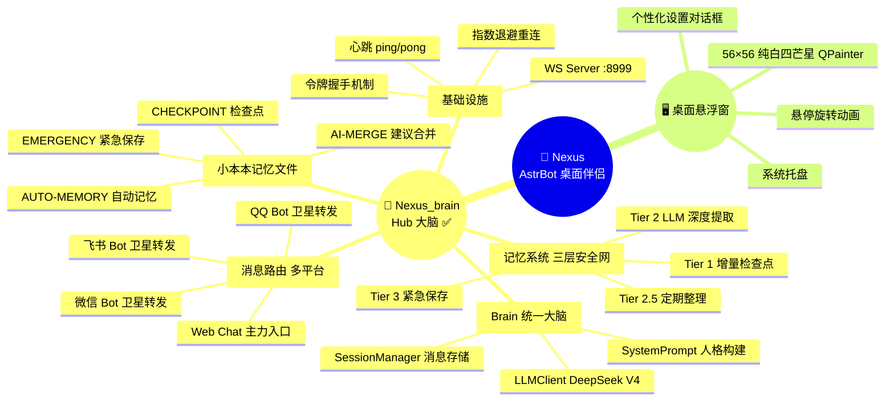
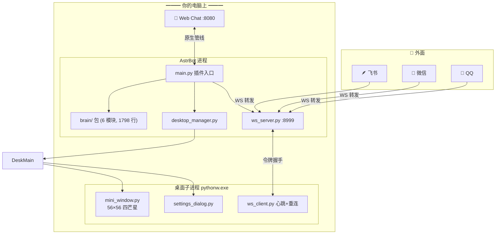

# 🌟 Nexus_brain — AstrBot 的大脑

> 你家桌面的 AstrBot，现在同时在线 QQ、微信、飞书和 Web Chat 了（
>
> **v0.7.0** · MIT 开源 · [GitHub](https://github.com/yuanchu114514-spec/nexus-brain)
>
> 作者：**鹓雏** · [B站 @鹓雏](https://space.bilibili.com/621041105)

---

## 🤔 这玩意儿干嘛的

简单说：让 AstrBot 只有一个脑子。
在使用astrbot的过程中，我发现qq和微信上面的bot数据并不是互通的，所以我做了这个插件，这个插件是刚做完的，我不清楚会不会有什么BUG和问题，所以有问题请把问题和日志一起发到3176702947@qq.com

你在 QQ 上跟 AstrBot 聊考研，切到 Web Chat 它就不记得了——这种事情不会再发生了。Nexus_brain 把所有平台（QQ / 微信 / 飞书 / Web Chat）的消息全汇到一个大脑里处理，所以它永远记得你说过什么，永远是同一个人格。

桌面上还有个纯白四芒星悬浮窗，右键就能打开 Web Chat 开始聊天，或者打开「小本本」看看 AstrBot 记住了什么。

---

## 🧭 一图流



---

## 🏗 怎么做到的

### 一句话：一个大脑，多处入口

AstrBot 跑在你自己电脑上，QQ / 微信 / 飞书这些平台的消息只是「转发」过来给它看，它自己不动——记忆、人格、对话上下文全在你电脑上，不经过任何云。



核心理念：**不管从哪个入口说话，回你的都是同一个人。**

---

## 🧠 记忆系统 — 「小本本」

AstrBot 把记忆写在一个 Markdown 文件里（`AstrBot的小本本.md`），主人可以手写，它也会自己记。四层递进：

| 层级 | 什么时候触发 | 干啥 | 多快 |
|------|------------|------|------|
| **Tier 1** | 每 12 轮对话 | 把最近聊天记个草稿 | <50ms |
| **Tier 2** | 你 2 分钟没说话 / 聊太多了 | 调 LLM 好好提炼记忆 | ~3s |
| **Tier 2.5** | 每 3 次 Tier 2 | 把碎片记忆整理成段落 | ~3s |
| **Tier 3** | 插件关了 / 崩了 | 紧急保存没来得及记的 | <100ms |

还有去重、重要性打分、自动归类之类的细节优化，总之尽量让它记住该记的、忘掉该忘的。

---

## ✨ 好玩的点

| | |
|---|---|
| 🧠 | **会自己记笔记** — 聊着聊着她就把重要的事写进小本本了 |
| 💬 | **到处都在** — QQ / 微信 / 飞书 / Web Chat，全是一个人 |
| 🎨 | **名字随便改** — 改个角色名，记忆文件自动联动 |
| 🔌 | **即插即用** — 插件一开悬浮窗就出来了 |
| 🔒 | **数据不出电脑** — 记忆默认关，开了也只在本地 |
| 💓 | **断了自己连** — 心跳检测 + 自动重连，不用管 |

---

## 🤖 关于 AI 辅助开发

这个项目的大量代码是跟 AI 一起写的（Claude Code + DeepSeek-V4）。

大概流程是：我（鹓雏）定方向、做架构决策、审查代码、跑测试——AI 负责写代码、帮忙 debug、一起讨论设计。具体来说：

- 约 80% 的 Python 代码由 AI 辅助生成（包括 brain/ 包的 6 个模块，1798 行）
- 架构讨论：Hub 集中式 vs 对等复制 vs 完全集中式的权衡，最后跟 AI 讨论定了 Hub 方案
- Bug 定位：WS 心跳误触发、LLM 云端幻觉、双进程双 spawn 等坑是 AI 帮着找出来的
- 记忆系统的三层安全网、四阶段优化、重要性评分算法都是人机协作设计的

---

## 📦 怎么装

右键 `install.ps1` → **使用 PowerShell 运行**，完事。

脚本会自动找 AstrBot 插件目录、复制文件、装依赖。装完在 AstrBot 面板启用插件，悬浮窗就出来了。

首次用记得右键悬浮窗 → 个性化设置 → 填角色名、选记忆文件夹。

---

## 📁 里面有什么

```
Nexus_brain/
├── main.py                    # 插件入口
├── brain/                     # 🧠 大脑本体 (1798 行)
│   ├── __init__.py            #   协调器
│   ├── session.py             #   消息存储
│   ├── persona.py             #   人格 Prompt
│   ├── notebook.py            #   小本本读写
│   ├── memory.py              #   三层安全网
│   └── llm.py                 #   LLM 调用
├── ws_server.py               # WebSocket :8999
├── desktop_manager.py         # 桌面端子进程管理
├── hub_api.py                 # HTTP 健康检查
├── desktop/                   # 🖥️ PyQt5 悬浮窗
│   ├── main.py                #   托盘 + 信号线
│   ├── mini_window.py         #   56×56 四芒星
│   ├── ws_client.py           #   WS 客户端 心跳+重连
│   └── settings_dialog.py     #   个性化设置
├── config.example.yaml        # 配置模板
├── memory.example.md          # 示例小本本
├── LICENSE                    # MIT
└── metadata.yaml              # 插件元数据
```

---

## 📊 走过的路

```
v0.1.0  05-20  能跑了 — WS 通道 + 迷你悬浮窗 + 托盘
v0.3.0  05-21  重写 — 令牌握手 + Brain 统一 + session.json
v0.4.0  06-15  Hub 化 — 多平台平等接入 + 卫星 Bot 转发
v0.5.0  06-17  记忆觉醒 — 三层安全网 + 上下文优化 92K→20K
v0.5.1  06-18  记忆进化 — 四阶段质量优化 + AUTO-MERGE
v0.6.0  06-18  准备见人 — 白底蓝星 + 插件改名 + 隐私保护
v0.6.1  06-18  控制体重 — 小本本容量上限
v0.6.2  06-18  断线自己连 — 心跳 + 指数退避
v0.7.0  06-20  开源！— 1650 行拆成 6 模块 + 修了个隐私漏洞
```

---

## 🔧 用的啥

| 干什么 | 用什么 |
|--------|--------|
| 桌面悬浮窗 | Python 3.11+ / PyQt5 |
| 消息框架 | AstrBot v4.16+ |
| 大脑 | 你的astrbot
| 通信 | WebSocket JSON 帧 |
| 记忆 | Markdown 文件 + session.json |

---

## 📄

MIT · 作者 [**鹓雏**](https://space.bilibili.com/621041105) · 代码在 [GitHub](https://github.com/yuanchu114514-spec/nexus-brain)

感谢 [AstrBot](https://github.com/Soulter/AstrBot) 和 DeepSeek ❤️
