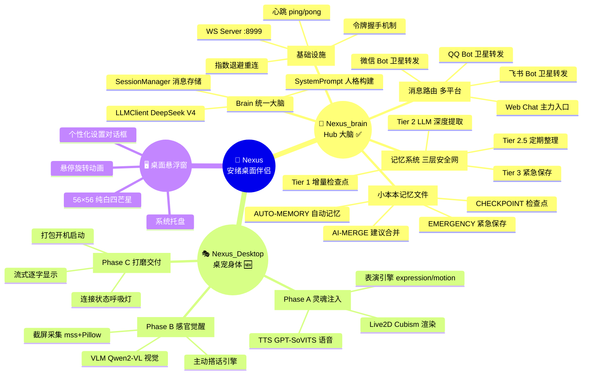
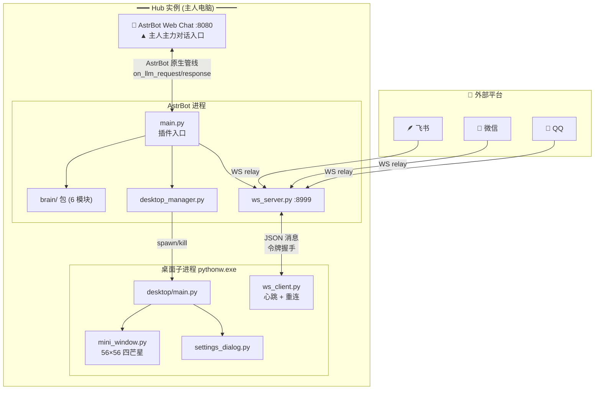

# 🌟 Nexus — 安绪桌面伴侣

> AstrBot 插件，让安绪拥有统一 AI 大脑。跨 QQ / 微信 / 飞书 / Web Chat 共享对话记忆，Live2D 桌宠常驻桌面。

**Nexus_brain v0.7.0-dev** (Hub 大脑 ✅) + **Nexus_Desktop** (桌宠身体 🆕)

---

## 🧭 项目全景



---

## 🏗 系统架构



---

## ✨ 特性

| | |
|---|---|
| ⭐ | **纯白四芒星悬浮窗** — 56×56，QPainter 贝塞尔曲线绘制，零外部图片资源 |
| 🧠 | **三层安全网记忆系统** — Tier 1 检查点 → Tier 2 LLM 提取 → Tier 3 紧急保存 |
| 💬 | **多平台统一大脑** — Web Chat / QQ / 微信 / 飞书共享 100% 对话上下文 |
| 🎨 | **个性化设置** — 角色名联动记忆文件 `{name}的小本本.md` |
| 🔌 | **即插即用** — 启用插件 → 悬浮窗自动出现 |
| 🔒 | **隐私保护** — 记忆默认关闭，config 参数化驱动 |
| 💓 | **心跳 + 指数退避重连** — 15s ping/pong，3s→30s 退避 |

---

## 📦 安装

1. 将 `Nexus_brain/` 放入 AstrBot 的 `data/plugins/` 目录
2. 复制 `config.example.yaml` 为 `config.yaml`，按需修改
3. 在 AstrBot 仪表板中启用 `Nexus_brain` 插件
4. 桌面悬浮窗自动出现！

> 首次使用：右键悬浮窗 → 个性化设置 → 配置角色名和记忆文件夹

---

## 🧠 记忆系统

安绪的记忆系统基于 Markdown 文件（小本本），四层递进：

| 层级 | 触发条件 | 操作 | 耗时 |
|------|---------|------|------|
| **Tier 1** | 每 12 轮 | 原始对话摘要 → CHECKPOINT 段 | <50ms |
| **Tier 2** | 空闲 2min / 压力 ≥80% / 兜底 25 轮 | LLM 深度提取 → AUTO-MEMORY（含语义去重 + 版本 ID） | ~3s |
| **Tier 2.5** | 每 3 次 Tier 2 | LLM 整理合并碎片 + 归类 | ~3s |
| **Tier 3** | 插件终止 | dump 未同步消息 → EMERGENCY 段 | <100ms |

**质量保障**：重要性评分（关键词+长度+情感）→ 分级截断（500-2000 字）→ 语义去重（difflib >0.85）→ AUTO-MERGE 高置信度自动合并。

---

## 📁 项目结构

```
Nexus_brain/                          ← AstrBot 插件 (已完成)
├── main.py                           #   插件入口 · 消息路由
├── brain/                            #   统一大脑 (6 模块, 1798 行)
│   ├── __init__.py                   #     Brain 协调器
│   ├── session.py                    #     SessionManager — 消息存储
│   ├── persona.py                    #     SystemPrompt — 人格构建
│   ├── notebook.py                   #     NotebookIO — 小本本 I/O
│   ├── memory.py                     #     MemoryManager — 三层安全网
│   └── llm.py                        #     LLMClient — LLM 调用
├── ws_server.py                      #   WS :8999 · 令牌握手
├── desktop_manager.py                #   子进程管理 · .desktop.lock 互斥
├── hub_api.py                        #   HTTP 健康检查
├── desktop/                          #   PyQt5 悬浮窗
│   ├── main.py                       #     子进程入口 · 托盘
│   ├── mini_window.py                #     56×56 纯白四芒星
│   ├── ws_client.py                  #     WS 客户端 · 心跳 · 指数退避
│   └── settings_dialog.py            #     个性化设置对话框
├── config.example.yaml               #   配置模板
├── memory.example.md                 #   示例记忆文件
└── metadata.yaml                     #   插件元数据

Nexus_Desktop/                        ← 桌宠身体插件 (待开工)
├── live2d/                           #   Cubism SDK 渲染
├── performance.py                    #   表演指令执行
├── tts_player.py                     #   TTS 语音合成
├── screen_capture.py                 #   截屏采集
├── vlm_client.py                     #   VLM 视觉感知
└── nudge_engine.py                   #   主动搭话

安绪_Nexus/                           ← 统一项目文件夹
├── README.md                         #   本文件
├── Project_Nexus_计划.md              #   完整技术文档 (13 张架构图)
├── Nexus_Desktop_计划.md              #   Desktop 插件计划
└── 记忆/                             #   长期记忆 (Git 仓库)
    └── 安绪的小本本.md                #     brain.py 启动加载 + 自动同步
```

---

## 📊 进度

```
Nexus_brain  v0.1.0 → v0.7.0-dev  ████████████████████ 100%
Nexus_Desktop Phase A/B/C          ░░░░░░░░░░░░░░░░░░░░   0%
─────────────────────────────────────────────────────────────
总体                                ████████████████░░░░  89%
```

| 版本 | 日期 | 里程碑 |
|------|------|--------|
| v0.3.0 | 05-21 | 令牌握手 + Brain 统一 |
| v0.4.0 | 06-15 | Hub 集中式 + 多平台平等 |
| v0.5.0 | 06-17 | 三层安全网 |
| v0.5.1 | 06-18 | 四阶段记忆质量优化 |
| v0.6.0 | 06-18 | 开源准备 + 白底蓝星 + 插件改名 |
| v0.6.1 | 06-18 | 容量控制 |
| v0.6.2 | 06-18 | WS 心跳 + 指数退避 |
| v0.7.0-dev | 06-18 | brain.py → brain/ 6 模块拆分 |
| v0.7.0 | 06-20 | 开源发布 · .gitignore 隐私修复 · LICENSE |

> 📋 完整迭代历史、架构图、设计决策 → [`Project_Nexus_计划.md`](Project_Nexus_计划.md)

---

## 🎨 个性化

右键悬浮窗 → 个性化设置：

- **角色名** — 修改后记忆文件自动联动为 `{名字}的小本本.md`
- **记忆文件夹** — 选择目录存放记忆，勾选启用
- **打开记忆文件夹** — 右键菜单直接跳转资源管理器

---

## 🔧 技术栈

| 层次 | 选型 |
|------|------|
| 桌面客户端 | Python 3.11+ / PyQt5 |
| Live2D | QWebEngineView + PixiJS + Cubism SDK |
| 消息中枢 | AstrBot v4.25+ |
| LLM | DeepSeek V4 |
| 视觉模型 | Qwen2-VL-7B-GGUF (可选) |
| TTS | GPT-SoVITS (本地 HTTP API) |
| 通信 | WebSocket JSON 帧 + 令牌握手 |
| 记忆存储 | Markdown 文件 + session.json |

---

## 📄 协议

MIT
