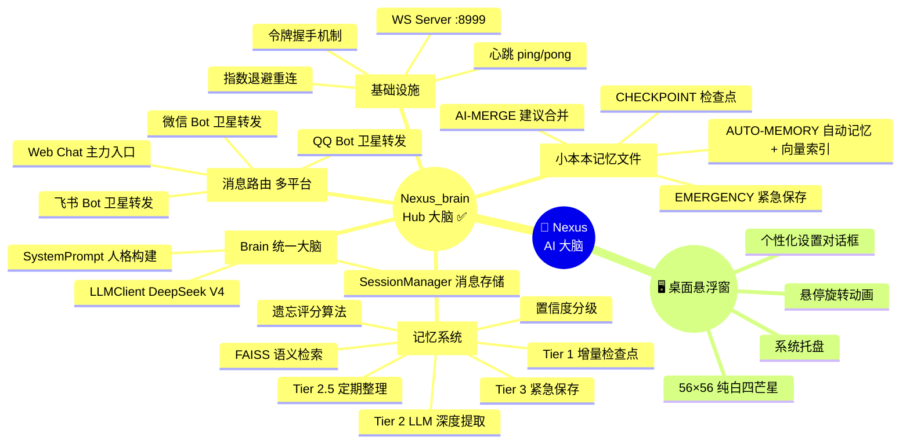
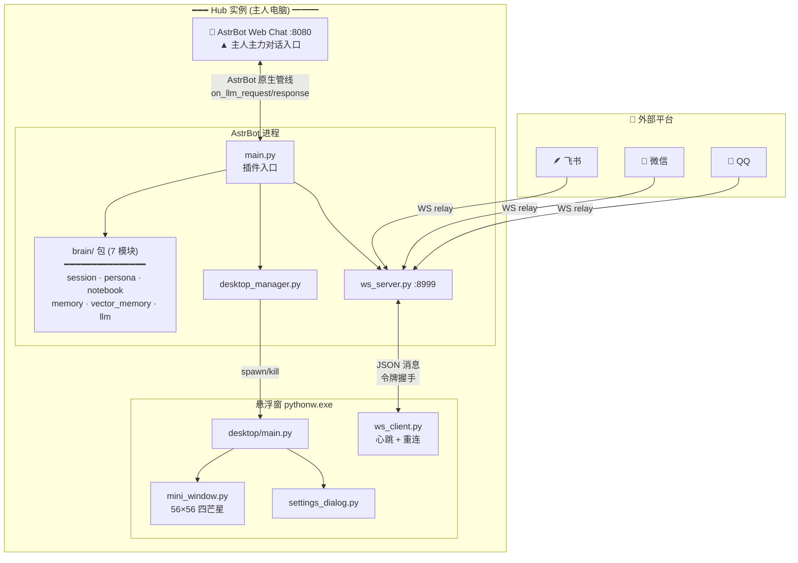

# 🧠 Nexus —AstrBot AI 大脑

> AstrBot 插件，集中式多平台 AI 大脑。跨 QQ / 微信 / 飞书 / Web Chat 共享对话记忆。

**Nexus_brain v0.8.0-dev** — FAISS 语义检索 + 遗忘算法 + 置信度分级

---

## 🧭 项目全景



---

## 🏗 系统架构



---

## ✨ 特性

| | |
|---|---|
| 🧠 | **三层安全网记忆系统** — Tier 1 检查点 → Tier 2 LLM 提取 → Tier 3 紧急保存 |
| 🔍 | **FAISS 语义检索** — 向量化记忆，按相关性注入 System Prompt |
| 📊 | **遗忘评分算法** — 近因性 + 置信度 + 频率加权，智能淘汰低价值记忆 |
| 🏷️ | **置信度分级** — HIGH/MEDIUM/LOW 三级，高置信记忆受保护 |
| 💬 | **多平台统一大脑** — Web Chat / QQ / 微信 / 飞书共享 100% 对话上下文 |
| 📓 | **小本本 Markdown 记忆** — 人类可读，FAISS 双写，手动编辑友好 |
| 🖥️ | **纯白四芒星悬浮窗** — 56×56，QPainter 贝塞尔曲线，零外部图片资源 |
| 🔌 | **即插即用** — 启用插件即可，零配置向量存储自动初始化 |

---

## 📦 安装

1. 将 `Nexus_brain/` 放入 AstrBot 的 `data/plugins/` 目录
2. 在 AstrBot 仪表板中启用 `Nexus_brain` 插件
3. 悬浮窗自动出现，右键可配置角色名和记忆文件夹

> 可选 `pip install sentence-transformers` 获得最佳语义检索效果

---

## 🧠 记忆系统

| 层级 | 触发条件 | 操作 | 耗时 |
|------|---------|------|------|
| **Tier 1** | 每 12 轮 | 原始对话摘要 → CHECKPOINT 段 | <50ms |
| **Tier 2** | 空闲 / 压力 / 兜底 25 轮 | LLM 深度提取 → AUTO-MEMORY + FAISS 双写（含语义去重 + 置信度分级） | ~3s |
| **Tier 2.5** | 每 3 次 Tier 2 | LLM 合并碎片 + 归类 | ~3s |
| **Tier 3** | 插件终止 | dump 未同步消息 → EMERGENCY 段 | <100ms |

**遗忘算法**: `S = 0.30·R + 0.40·C + 0.30·F` — 近因性 × 置信度 × 频率加权评分，低于阈值自动淘汰。

> 设计参考 [Iris Chat Memory](https://github.com/leafliber/astrbot_plugin_iris_chat_memory)

---

## 📁 项目结构

```
Nexus_brain/                          ← AstrBot 插件
├── main.py                           #   插件入口 · 消息路由
├── brain/                            #   统一大脑 (7 模块)
│   ├── __init__.py                   #     Brain 协调器
│   ├── session.py                    #     SessionManager — 消息存储
│   ├── persona.py                    #     SystemPrompt — 人格构建
│   ├── notebook.py                   #     NotebookIO — 小本本 I/O
│   ├── memory.py                     #     MemoryManager — 三层安全网
│   ├── vector_memory.py              #     VectorMemoryStore — FAISS 语义检索
│   └── llm.py                        #     LLMClient — LLM 调用
├── ws_server.py                      #   WS :8999 · 令牌握手
├── desktop_manager.py                #   子进程管理 · .desktop.lock
├── hub_api.py                        #   HTTP 健康检查
├── desktop/                          #   PyQt5 悬浮窗
│   ├── main.py                       #     子进程入口 · 托盘
│   ├── mini_window.py                #     56×56 纯白四芒星
│   ├── ws_client.py                  #     WS 客户端 · 心跳 · 指数退避
│   └── settings_dialog.py            #     个性化设置
├── config.example.yaml               #   配置模板
├── metadata.yaml                     #   插件元数据
├── Project_Nexus_计划.md              #   完整技术文档
└── README.md                         #   本文件
```

---

## 📊 版本

| 版本 | 日期 | 里程碑 |
|------|------|--------|
| v0.3.0 | 05-21 | 令牌握手 + Brain 统一 |
| v0.4.0 | 06-15 | Hub 集中式 + 多平台平等 |
| v0.5.0 | 06-17 | 三层安全网 |
| v0.5.1 | 06-18 | 四阶段记忆质量优化 |
| v0.6.0 | 06-18 | 开源准备 + 插件改名 |
| v0.6.1 | 06-18 | 容量控制 |
| v0.6.2 | 06-18 | WS 心跳 + 指数退避 |
| v0.7.0 | 06-20 | brain.py → brain/ 6 模块拆分 |
| v0.8.0-dev | 06-23 | FAISS 语义检索 + 遗忘算法 + 置信度分级 |

---

## 🔧 技术栈

| 层次 | 选型 |
|------|------|
| 消息中枢 | AstrBot v4.25+ |
| LLM | DeepSeek V4 |
| 嵌入模型 | BAAI/bge-small-zh-v1.5 (本地 512 维) |
| 向量存储 | FAISS IndexFlatIP |
| 记忆存储 | Markdown 文件 + FAISS 双写 + session.json |
| 桌面悬浮窗 | Python 3.12 / PyQt5 |
| 通信 | WebSocket JSON 帧 + 令牌握手 |

---

## 📄 协议

MIT
