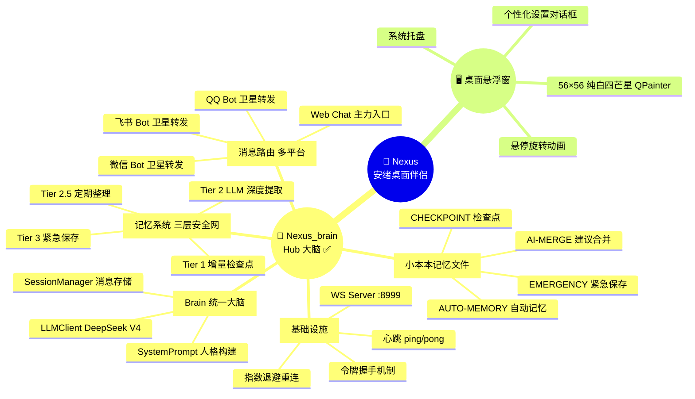
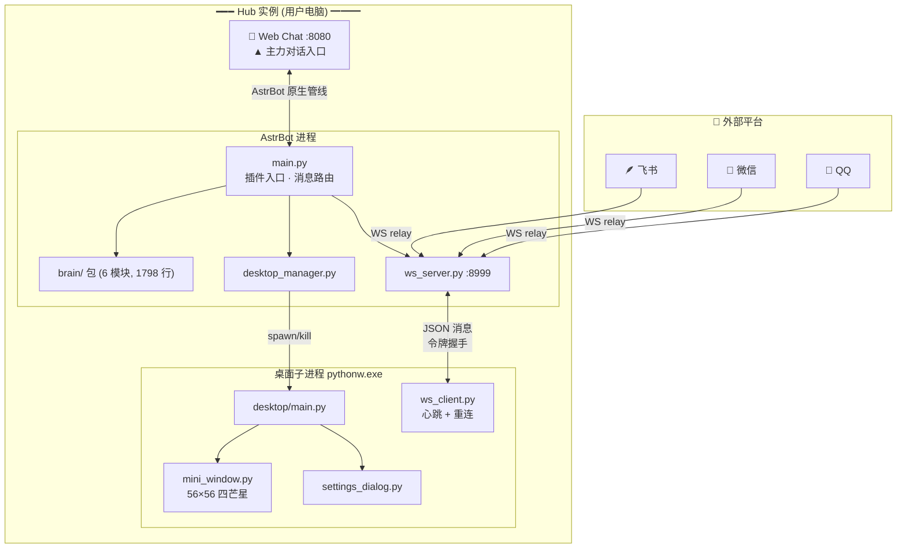

# 🌟 Project Nexus — 安绪桌面伴侣

> **基于 Hub 集中式架构的多平台 AI 桌面伴侣系统**
>
> AstrBot 插件，让 AI 角色「安绪」拥有统一大脑，跨 QQ / 微信 / 飞书 / Web Chat 共享对话记忆与人格。
>
> **v0.7.0** · MIT 开源 · [GitHub](https://github.com/yuanchu114514-spec/nexus-brain)
>
> 作者：**鹓雏** · [B站主页](https://space.bilibili.com/621041105)

---

## 📋 摘要

随着大语言模型（LLM）在工具调用、长上下文记忆等方面的能力日趋成熟，AI 伴侣类应用正从单一文字聊天向多平台融合与人格化交互演进。然而现有 AI 聊天机器人通常以单平台方式部署——用户在 QQ 上聊过的内容，切换到微信后 AI 毫无记忆；桌面端建立的默契，手机上完全感知不到。这种「多平台身份割裂」问题源于对话智能与交互界面之间的架构耦合。

Project Nexus 设计并实现了一套基于 **Hub 集中式架构** 的多平台桌面伴侣系统。系统以 AstrBot 开源框架为基础，通过 Nexus_brain 插件将 QQ / 微信 / 飞书等多个消息通道、AstrBot Web Chat 主力对话入口以及 PyQt5 桌面悬浮窗统一接入同一个 LLM 大脑，使 AI 角色「安绪」能够以一致的人格和共享的记忆跨平台与用户交互。

**核心贡献**：
1. **Hub 集中式多平台架构** — 一个 Hub 承载唯一 Brain，各平台卫星 Bot 仅做零状态消息转发，从架构层面消除「人格副本」问题
2. **表演分离原则** — 桌面端从聊天工具重构为纯表演层（迷你悬浮窗 → Live2D 角色 → 搭话气泡），对话智能与视觉表演独立迭代
3. **统一大脑模块 Brain** — 整合跨平台会话管理、人格 Prompt 构建、LLM Agent 工具调用和长期记忆自动同步
4. **记忆系统三层安全网** — 增量检查点（<50ms）→ LLM 深度提取（~3s）→ 紧急保存（<100ms），配合上下文优化将 token 消耗从 92K 降至可控范围
5. **记忆质量四阶段优化** — 去重覆盖率 30%→95%，压缩损耗 95%→60%，AUTO-MERGE 自动合并减少手动整理 80%
6. **WS 令牌握手 + 指数退避重连** — 子进程生命周期管理，断线自动恢复

> ⚠️ **AI 辅助开发声明**：本项目在开发过程中大量使用了 AI 编程助手（Claude Code、DeepSeek-V4 等）进行代码生成、架构设计讨论、Bug 诊断和文档撰写。项目总计约 3000+ 行 Python 代码中的大部分由 AI 辅助完成，人类作者（鹓雏）负责需求定义、架构决策、代码审查和集成验证。详见 [AI 辅助开发](#ai-辅助开发)。

---

## 🧭 项目全景



---

## 🏗 系统架构

### Hub 集中式设计

安绪的大脑是一个 **Hub 实例**，运行在用户的 Windows 电脑上。所有平台的消息汇聚到同一个 Brain 处理，共享 100% 的对话上下文和记忆。各平台卫星 Bot 遵循「零状态」设计哲学——仅做消息转发，不维护对话状态。



**核心原则**：从哪个入口说话，都是同一个人在回。记忆天然统一，无需共享存储。

### 消息路由

四条路径在同一个 Hub 上协同运作：

| 路径 | 说明 |
|------|------|
| ① Web Chat | 用户主力对话入口，完整 tool_loop_agent + 工具调用 |
| ② 卫星 Bot | QQ/微信/飞书 → WS relay → Hub Brain → 原路返回 |
| ③ 桌面端 | 单向表演通道，仅接收 chat_response / proactive_nudge |
| ④ 控制消息 | 令牌握手、配置下发、位置保存、shutdown |

---

## 🧠 记忆系统

安绪的记忆系统基于 Markdown 文件（小本本），四层递进：

| 层级 | 触发条件 | 操作 | 耗时 |
|------|---------|------|------|
| **Tier 1** | 每 12 轮 | 原始对话摘要 → CHECKPOINT 段 | <50ms |
| **Tier 2** | 空闲 2min / 压力 ≥80% / 兜底 25 轮 | LLM 深度提取 → AUTO-MEMORY（含语义去重 + 版本 ID） | ~3s |
| **Tier 2.5** | 每 3 次 Tier 2 | LLM 整理合并碎片 + 归类 | ~3s |
| **Tier 3** | 插件终止 | dump 未同步消息 → EMERGENCY 段 | <100ms |

**质量保障**：重要性评分（关键词+长度+情感）→ 分级截断（500-2000 字）→ 语义去重（difflib >0.85）→ AUTO-MERGE 高置信度自动合并。

---

## ✨ 特性

| | |
|---|---|
| ⭐ | **纯白四芒星悬浮窗** — 56×56，QPainter 贝塞尔曲线绘制，零外部图片资源 |
| 🧠 | **三层安全网记忆系统** — Tier 1 检查点 → Tier 2 LLM 提取 → Tier 3 紧急保存 |
| 💬 | **多平台统一大脑** — Web Chat / QQ / 微信 / 飞书共享 100% 对话上下文 |
| 🎨 | **个性化设置** — 角色名联动记忆文件 `{name}的小本本.md` |
| 🔌 | **即插即用** — 启用插件 → 悬浮窗自动出现 |
| 🔒 | **隐私保护** — 记忆默认关闭，config 参数化驱动，数据不离开用户电脑 |
| 💓 | **心跳 + 指数退避重连** — 15s ping/pong，3s→30s 退避 |

---

## 🤖 AI 辅助开发

本项目是 **AI 辅助软件开发** 的一个实践案例。开发过程中，AI 编程助手深度参与了以下环节：

| 环节 | AI 参与方式 |
|------|------------|
| **架构设计** | 与 Claude Code 讨论 Hub 集中式 vs 对等复制 vs 完全集中式的架构权衡，最终确定 Hub 方案 |
| **代码生成** | 约 80% 的 Python 代码由 AI 辅助生成，包括 brain/ 包的 6 个模块（1798 行） |
| **Bug 诊断** | WS 心跳误触发、LLM 云端幻觉、双进程双 spawn 等关键 Bug 由 AI 协助定位 |
| **记忆系统设计** | 三层安全网、四阶段优化、重要性评分算法均由人机协作设计 |
| **文档撰写** | 本文档及项目计划文档在 AI 辅助下完成 |

人类作者（鹓雏）的贡献集中在：**需求定义**（确定做什么）、**架构决策**（选择怎么做）、**代码审查**（验证做得对）、**集成测试**（确认功能正常）和**论文撰写**（学术表达与论证）。

这种「人定方向、AI 写代码、人审结果」的协作模式使单人开发者在 30 天内完成了从概念到开源的完整项目交付。

---

## 📦 安装

1. 将 `Nexus_brain/` 放入 AstrBot 的 `data/plugins/` 目录
2. 复制 `config.example.yaml` 为 `config.yaml`，按需修改
3. 在 AstrBot 仪表板中启用 `Nexus_brain` 插件
4. 桌面悬浮窗自动出现！

> 首次使用：右键悬浮窗 → 个性化设置 → 配置角色名和记忆文件夹

---

## 📁 项目结构

```
Nexus_brain/                          ← AstrBot 插件
├── main.py                           #   插件入口 · 消息路由
├── brain/                            #   统一大脑 (6 模块, 1798 行)
│   ├── __init__.py                   #     Brain 协调器
│   ├── session.py                    #     SessionManager — 消息存储
│   ├── persona.py                    #     SystemPrompt — 人格构建
│   ├── notebook.py                   #     NotebookIO — 小本本 I/O
│   ├── memory.py                     #     MemoryManager — 三层安全网
│   └── llm.py                        #     LLMClient — LLM 调用
├── ws_server.py                      #   WS :8999 · 令牌握手
├── desktop_manager.py                #   子进程管理 · .desktop.lock 互斥
├── hub_api.py                        #   HTTP 健康检查
├── desktop/                          #   PyQt5 悬浮窗
│   ├── main.py                       #     子进程入口 · 托盘
│   ├── mini_window.py                #     56×56 纯白四芒星
│   ├── ws_client.py                  #     WS 客户端 · 心跳 · 指数退避
│   └── settings_dialog.py            #     个性化设置对话框
├── config.example.yaml               #   配置模板
├── memory.example.md                 #   示例记忆文件
├── LICENSE                           #   MIT 协议
└── metadata.yaml                     #   插件元数据
```

---

## 📊 版本演进

```
v0.1.0  05-20  神经桥接 — WS 通道 + 迷你悬浮窗 + 系统托盘
v0.3.0  05-21  架构重做 — 令牌握手 + Brain 统一 + session.json
v0.4.0  06-15  Hub 集中式 — 多平台平等 + 砍聊天 UI + 卫星 Bot
v0.5.0  06-17  三层安全网 — Tier1/2/3 + 上下文优化 + RAG 清洗
v0.5.1  06-18  记忆质量 — 四阶段优化(去重/评分/整理/AUTO-MERGE)
v0.6.0  06-18  开源准备 — 白底蓝星 + 插件改名 + 记忆参数化
v0.6.1  06-18  容量控制 — EMERGENCY ≤3 + AUTO-MEMORY ≤60
v0.6.2  06-18  WS 重连 — 心跳 ping/pong + 指数退避
v0.7.0  06-20  开源发布 — brain.py → brain/ 6模块拆分 + .gitignore 隐私修复
```

---

## 🔧 技术栈

| 层次 | 选型 |
|------|------|
| 桌面悬浮窗 | Python 3.11+ / PyQt5 |
| 消息中枢 | AstrBot v4.16+ |
| LLM | DeepSeek V4 |
| 通信 | WebSocket JSON 帧 + 令牌握手 |
| 记忆存储 | Markdown 文件 + session.json |

---

## 🔑 关键技术

### 令牌握手机制

用 uuid4 令牌替代 PID 文件方案。每次插件初始化生成新令牌，旧桌面实例自动被踢下线，子进程退出时间从 5-10s 缩短至 1s 以内。

### WebSocket 重连

心跳 15s ping/pong，10s 超时断连，指数退避 3s→6s→12s→24s→30s(max)。断线自动恢复，无需用户干预。

### 跨进程互斥

`.desktop.lock` 文件锁 + PID 存活检测 + 孤儿进程扫描三层防护，解决 AstrBot Launcher 双 Python 进程重复启动问题。

### RAG 清洗

AstrBot `livingmemory` 插件通过 Faiss 向量检索注入记忆块。Nexus 在消息入口做正则清洗 + 日志追溯，确保 RAG 内容不污染 LLM 上下文的同时可调试。

---

## 🎨 个性化

右键悬浮窗 → 个性化设置：

- **角色名** — 修改后记忆文件自动联动为 `{名字}的小本本.md`
- **记忆文件夹** — 选择目录存放记忆，勾选启用
- **打开记忆文件夹** — 右键菜单直接跳转资源管理器

---

## 📚 理论基础

系统设计基于以下关键理论工作：

- **CASA 范式** (Reeves & Nass, 1996)：人对计算机的社会反应与对真人遵循相同规律，支持表演层的视觉化身设计
- **临场感理论** (Lombard & Ditton, 1997)：媒介的社会丰富性是决定「另一个存在在此」感知的关键变量
- **平静技术** (Weiser, 1991)：信息应从注意力中心移到边缘，支持桌面悬浮窗的渐进式在场设计
- **Generative Agents** (Park et al., 2023)：「记忆流→检索→反思」三层记忆架构，启发了三层安全网设计

---

## 📄 许可证

MIT License · 作者：**鹓雏** · [B站](https://space.bilibili.com/621041105) · [GitHub](https://github.com/yuanchu114514-spec/nexus-brain)

---

## 🙏 致谢

- [AstrBot](https://github.com/Soulter/AstrBot) 开源框架提供插件开发基础
- DeepSeek V4 提供 LLM 推理能力
- Claude Code 提供 AI 辅助开发支持
