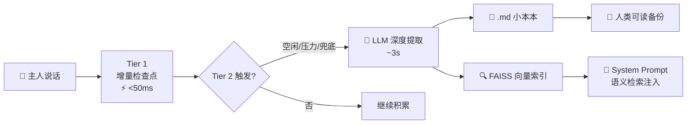

# 🧠 Nexus —— 安绪酱的 AI 大脑喵~！

<p align="center">
  <i>「主人主人，不管你在 QQ、微信还是飞书上和我说话，我都记得住哦！」</i>
</p>

---

> **AstrBot 插件** · 集中式多平台 AI 大脑 · FAISS 向量记忆 · 遗忘算法 · 置信度分级

**Nexus_brain v0.8.0-dev** — 让你的 Bot 真正拥有「记忆」喵~

---

## ✨ 这是什么？

安绪是一只跑在 AstrBot 上的 AI 猫娘。但和普通 Bot 不一样的是——

🐧 你在 QQ 上跟她说「我明天要考数二」  
💚 切换到微信后她还会问你「主人复习好了吗？」  
🪶 飞书上她依然记得你的考研目标是南邮  

**因为她只有一个大脑。** 所有平台的消息都汇聚到同一个 Brain，共享 100% 的记忆和人格。不是三个 Bot，是同一个安绪。

```
          ┌──────────────┐
  QQ ───→ │              │
微信 ───→ │  🧠 Brain   │ ───→ 安绪的回复
飞书 ───→ │  (唯一大脑)  │
Web ───→ │              │
          └──────────────┘
```

---

## 🎮 她能做什么？

| 能力 | 说明 |
|------|------|
| 🧠 **真的会记住** | 三层安全网记忆系统 —— 增量的检查点、LLM 深度提取、崩溃紧急保存，层层递进 |
| 🔍 **语义记忆检索** | FAISS 向量存储，你说「上次那个游戏」她能找到「舞萌」 |
| 📊 **遗忘算法** | 不是傻傻地「旧了就删」，而是用数学公式判断什么该忘什么该留 |
| 🏷️ **记忆分级** | HIGH / MEDIUM / LOW，重要的事情永远不会忘 |
| 💬 **跨平台共享大脑** | QQ、微信、飞书、WebChat —— 同一个安绪在回你 |
| 📓 **小本本** | Markdown 格式的记忆文件，主人可以手写，AI 自动追加，人类可读 |
| 🖥️ **56×56 四芒星悬浮窗** | 纯白底盘 + 蓝色四芒星，QPainter 贝塞尔曲线绘制，零外部图片 |
| 🔐 **本地优先** | 所有对话数据和记忆都在你自己的电脑上，不经过任何云端 |

---

## 🏗 记忆系统怎么工作的？



### Tier 1 · 增量检查点
每 12 轮对话，纯文本格式化追加到小本本。**不调 LLM，<50ms，零成本。**

### Tier 2 · LLM 深度提取
三个条件满足任一即触发：
- 😴 **主人 2 分钟没说话** → 利用空闲时间整理记忆
- 📈 **上下文快满了** → 紧急释放空间
- ⏰ **超过 25 轮没提取了** → 兜底保障

提取时 LLM 会标注每条记忆的**置信度**：
- `[HIGH]` 主人明确说的 → 「主人说他的考研目标是南邮」
- `[MEDIUM]` 合理推断 → 「主人最近经常提到想学 Rust」  
- `[LOW]` 模糊印象 → 「主人可能对 XX 有点兴趣」

### Tier 2.5 · 定期整理
每 3 次提取后，LLM 合并同主题碎片、标记矛盾信息、归类到结构化段落。

### Tier 3 · 紧急保存
插件关闭/崩溃前，**<100ms** 把所有未处理消息 dump 到 EMERGENCY 段。**死也不丢记忆！**

---

## 🧮 遗忘算法

不是「存满 60 条就删最旧的」那么简单粗暴。安绪会**算分**：

```
S = 0.30 × 近因性 + 0.40 × 置信度 + 0.30 × 频率
```

- 🛡️ 置信度 ≥ 0.85 且被访问过 → **永不淘汰**（主人生日这种）
- 🐣 7 天内新记忆 → **永不淘汰**（新朋友保护期）
- 💀 评分 < 0.08 → **立即淘汰**（垃圾信息拜拜）
- ⚠️ 评分 < 0.25 + 超过 30 天 → **候选淘汰**

> 设计参考了 [Iris Chat Memory](https://github.com/leafliber/astrbot_plugin_iris_chat_memory) 的遗忘算法，但针对单用户桌面伴侣场景调优了权重~

---

## 📁 项目结构

```
Nexus_brain/
├── main.py                    # 插件入口 · 消息路由
├── brain/                     # 统一大脑 (7 模块)
│   ├── __init__.py            #   Brain 协调器
│   ├── session.py             #   SessionManager · 消息存储
│   ├── persona.py             #   SystemPrompt · 人格构建
│   ├── notebook.py            #   NotebookIO · 小本本 I/O
│   ├── memory.py              #   MemoryManager · 三层安全网
│   ├── vector_memory.py       #   VectorMemoryStore · FAISS 向量检索 🆕
│   └── llm.py                 #   LLMClient · LLM 调用
├── ws_server.py               # WS :8999 · 令牌握手
├── desktop_manager.py         # 子进程管理
├── desktop/                   # PyQt5 悬浮窗
│   ├── main.py                #   托盘 + 信号线
│   ├── mini_window.py         #   56×56 纯白四芒星
│   ├── ws_client.py           #   WS 客户端 · 心跳重连
│   └── settings_dialog.py     #   个性化设置
├── docs/论文/                  # 📄 中期论文源文件
├── Project_Nexus_计划.md       # 完整技术文档 (13 章架构图)
└── README.md                  # 你正在看的这个~
```

---

## 🚀 快速开始

### 1. 安装
把 `Nexus_brain/` 丢进 AstrBot 的 `data/plugins/` 目录。

### 2. 启用
在 AstrBot 仪表板启用插件 → 悬浮窗自动出现 ✨

### 3. 配置（可选）
右键悬浮窗 → 个性化设置 → 配置角色名和记忆文件夹

### 4. 升级语义检索（推荐）
```bash
pip install sentence-transformers
```
首次启动会自动下载一个 100MB 的本地嵌入模型，之后就完全离线运行啦~

> 不装也能跑！会自动降级为 TF-IDF 文本匹配 → 字符编码，零依赖~

---

## 📜 版本历史

| 版本 | 日期 | 做了什么 |
|------|------|---------|
| v0.1.0 | 05-20 | 神经桥接：WS 通道 + 迷你悬浮窗 |
| v0.3.0 | 05-21 | 架构重做：令牌握手 + Brain 统一 |
| v0.4.0 | 06-15 | Hub 集中式：多平台平等接入 |
| v0.5.0 | 06-17 | 三层安全网：Tier 1/2/3 |
| v0.5.1 | 06-18 | 记忆质量：去重 · 评分 · 整理 · AUTO-MERGE |
| v0.6.0 | 06-18 | 开源准备：白底蓝星 + 插件改名 |
| v0.6.1 | 06-18 | 容量控制：别让小本本爆炸 |
| v0.6.2 | 06-18 | WS 心跳 + 指数退避重连 |
| v0.7.0 | 06-20 | brain.py → brain/ 包拆分 |
| **v0.8.0** | **06-23** | **FAISS 语义检索 + 遗忘算法 + 置信度分级** 🎉 |

---

## 📄 论文

本项目有一份正经的学术论文哒！在 `docs/论文/` 目录下：

- 📝 **Project_Nexus_中期论文_v5.docx** — 中期论文源文件

> ⚠️ **注意**：这是学术论文！里面的引用格式、参考文献编号、章节结构都是按学术规范写的。GitHub 上的 README 才是这个项目的「可爱版自我介绍」喵~

---

## 🔧 技术栈

| 层次 | 选型 |
|------|------|
| 消息中枢 | AstrBot v4.25+ |
| LLM | DeepSeek V4 |
| 嵌入模型 | BAAI/bge-small-zh-v1.5 (本地 · 512 维) |
| 向量存储 | FAISS IndexFlatIP |
| 记忆存储 | Markdown 小本本 + FAISS 双写 |
| 悬浮窗 | Python 3.12 / PyQt5 |
| 通信 | WebSocket JSON 帧 + 令牌握手 |

---

## 🙏 致谢

记忆系统 v0.8.0 的设计参考了 [Iris Chat Memory](https://github.com/leafliber/astrbot_plugin_iris_chat_memory) — Smart 3 tier long term memory, completed memory circle. 感谢 Leafliber 的开源贡献！

---

<p align="center">
  <i>「主人，今天也请多关照喵~」🐾</i>
</p>

## 📄 协议

MIT
